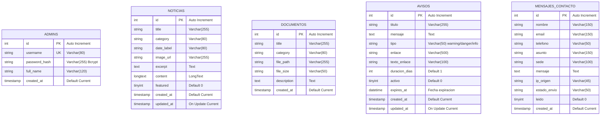
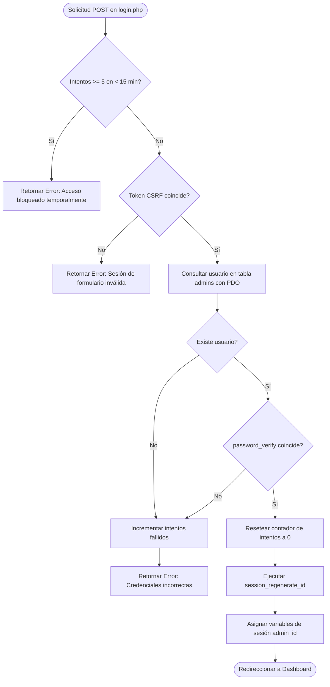
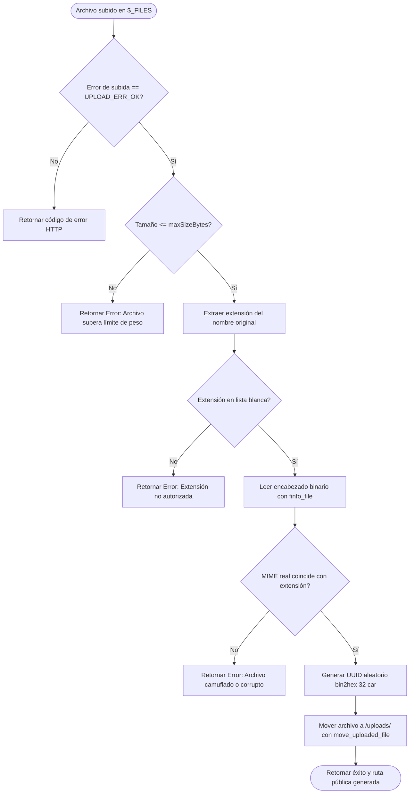
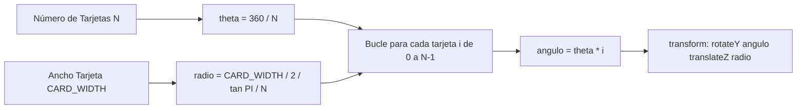

# MANUAL DEL PROGRAMADOR Y ESPECIFICACIÓN TÉCNICA
## Portal Web Institucional & Sistema de Gestión de Contenidos (CMS)
### Institución Educativa Gilberto Alzate Avendaño — Medellín, Colombia

---

# 1. PORTADA

| Elemento Institucional | Información Oficial del Proyecto |
| :--- | :--- |
| **Institución Educativa** | Institución Educativa Gilberto Alzate Avendaño |
| **Municipio y Departamento** | Medellín, Antioquia — Colombia |
| **Nombre del Proyecto** | Portal Web Institucional y Sistema de Gestión de Contenidos |
| **Integrantes del Equipo** | **Dainkel Yosue Cuello Rangel**<br>**Ruben Dario Betancourt Morales**<br>**Maicol Alexis Puerta Velez** |
| **Docente Titular** | **Luis Fernando Velazques Restrepo** |
| **Grado Académico** | **11-3** |
| **Año Lectivo** | **2026** |
| **Versión del Software** | **3.0 — Full-Stack Dinámico & Producción** |
| **Entorno de Ejecución** | Servidor Web Apache 2.4+ / PHP 8.2+ / MySQL 8.0+ (XAMPP) |
| **Repositorio Oficial** | [github.com/Rv3ndbm/Portal-Institucional](https://github.com/Rv3ndbm/Portal-Institucional) |

> [!NOTE]
> **Aclaración sobre el Alojamiento Web del Proyecto:**  
> La publicación actual en **GitHub Pages** es una medida de despliegue temporal para visualización pública de la capa frontend. Dado que GitHub Pages únicamente interpreta archivos planos y estáticos (HTML, CSS, JS), **el backend dinámico (PHP 8.2+), el motor de base de datos relacional (MySQL) y el panel administrativo seguro (CRUD)** se ejecutan de forma local bajo el servidor **XAMPP**. Una vez finalizado el ciclo lectivo y realizada la compra del dominio institucional y hosting definitivo (cPanel/VPS), se completará la migración íntegra del sistema a producción en la nube.

---

# 2. TABLA DE CONTENIDO

1. [Portada](#1-portada)
2. [Tabla de Contenido](#2-tabla-de-contenido)
3. [Introducción](#3-introducción)
   * 3.1 [Objetivo del Manual](#31-objetivo-del-manual)
   * 3.2 [Alcance del Proyecto](#32-alcance-del-proyecto)
   * 3.3 [Descripción General del Aplicativo](#33-descripción-general-del-aplicativo)
4. [Descripción del Proyecto](#4-descripción-del-proyecto)
   * 4.1 [Nombre del Software](#41-nombre-del-software)
   * 4.2 [Problema o Necesidad que Resuelve](#42-problema-o-necesidad-que-resuelve)
   * 4.3 [Justificación](#43-justificación)
   * 4.4 [Marco Teórico y Estado del Arte](#44-marco-teórico-y-estado-del-arte)
   * 4.5 [Objetivos del Proyecto (General y Específicos)](#45-objetivos-del-proyecto-general-y-específicos)
   * 4.6 [Metodología de Desarrollo](#46-metodología-de-desarrollo)
   * 4.7 [Público Objetivo](#47-público-objetivo)
   * 4.8 [Resultados y Productos Esperados](#48-resultados-y-productos-esperados)
5. [Requerimientos del Sistema](#5-requerimientos-del-sistema)
   * 5.1 [Requerimientos de Hardware](#51-requerimientos-de-hardware)
   * 5.2 [Requerimientos de Software](#52-requerimientos-de-software)
6. [Tecnologías Utilizadas](#6-tecnologías-utilizadas)
7. [Arquitectura del Proyecto](#7-arquitectura-del-proyecto)
   * 7.1 [Diagrama de Arquitectura Global](#71-diagrama-de-arquitectura-global)
   * 7.2 [Modelo Cliente-Servidor](#72-modelo-cliente-servidor)
   * 7.3 [Flujo Integral de Información](#73-flujo-integral-de-información)
8. [Estructura de Carpetas](#8-estructura-de-carpetas)
   * 8.1 [Árbol Físico del Repositorio](#81-árbol-físico-del-repositorio)
   * 8.2 [Función Técnica de Cada Directorio](#82-función-técnica-de-cada-directorio)
   * 8.3 [Convención de Rutas Relativas](#83-convención-de-rutas-relativas)
9. [Diseño de la Base de Datos](#9-diseño-de-la-base-de-datos)
   * 9.1 [Modelo Entidad-Relación (MER)](#91-modelo-entidad-relación-mer)
   * 9.2 [Diccionario de Datos Detallado](#92-diccionario-de-datos-detallado)
   * 9.3 [Tablas, Campos, Llaves Primarias y Restricciones](#93-tablas-campos-llaves-primarias-y-restricciones)
10. [Script de la Base de Datos](#10-script-de-la-base-de-datos)
    * 10.1 [Definición de Base de Datos y Codificación](#101-definición-de-base-de-datos-y-codificación)
    * 10.2 [Creación de Tablas DDL e Índices](#102-creación-de-tablas-ddl-e-índices)
    * 10.3 [Poblado Inicial DML y Datos por Defecto](#103-poblado-inicial-dml-y-datos-por-defecto)
    * 10.4 [Auto-Aprovisionamiento Automático en PHP](#104-auto-aprovisionamiento-automático-en-php)
11. [Módulos del Sistema](#11-módulos-del-sistema)
    * 11.1 [Módulo de Inicio de Sesión y Autenticación Administrativa](#111-módulo-de-inicio-de-sesión-y-autenticación-administrativa)
    * 11.2 [Módulo de Gestión de Noticias Institucionales (CRUD)](#112-módulo-de-gestión-de-noticias-institucionales-crud)
    * 11.3 [Módulo de Gestión de Documentos y Circulares (CRUD)](#113-módulo-de-gestión-de-documentos-y-circulares-crud)
    * 11.4 [Módulo de Avisos Urgentes y Banner de Emergencia](#114-módulo-de-avisos-urgentes-y-banner-de-emergencia)
    * 11.5 [Módulo de Perfil y Actualización Segura de Contraseña](#115-módulo-de-perfil-y-actualización-segura-de-contraseña)
    * 11.6 [Módulo de Formulario de Contacto y PQRSF](#116-módulo-de-formulario-de-contacto-y-pqrsf)
    * 11.7 [Módulo de Buscador Predictivo Multicriterio](#117-módulo-de-buscador-predictivo-multicriterio)
    * 11.8 [Módulo de Accesibilidad Universal (WCAG 2.1)](#118-módulo-de-accesibilidad-universal-wcag-21)
    * 11.9 [Módulo de Soporte Offline y Service Worker (PWA)](#119-módulo-de-soporte-offline-y-service-worker-pwa)
12. [Explicación del Código Fuente](#12-explicación-del-código-fuente)
13. [Funciones del Sistema](#13-funciones-del-sistema)
    * 13.1 [Funciones del Backend (PHP)](#131-funciones-del-backend-php)
    * 13.2 [Funciones del Frontend (JavaScript)](#132-funciones-del-frontend-javascript)
14. [Algoritmos Utilizados](#14-algoritmos-utilizados)
    * 14.1 [Algoritmo de Autenticación, Rate Limiting y CSRF](#141-algoritmo-de-autenticación-rate-limiting-y-csrf)
    * 14.2 [Algoritmo de Carga Segura de Archivos e Inspección MIME](#142-algoritmo-de-carga-segura-de-archivos-e-inspección-mime)
    * 14.3 [Algoritmo de Búsqueda Predictiva con Scoring](#143-algoritmo-de-búsqueda-predictiva-con-scoring)
    * 14.4 [Algoritmo Geométrico del Carrusel Cilíndrico 3D](#144-algoritmo-geométrico-del-carrusel-cilíndrico-3d)
15. [Seguridad del Sistema](#15-seguridad-del-sistema)
16. [Instalación del Proyecto](#16-instalación-del-proyecto)
17. [Configuración del Proyecto](#17-configuración-del-proyecto)
18. [Pruebas del Sistema](#18-pruebas-del-sistema)
19. [Control de Versiones](#19-control-de-versiones)
20. [Problemas Encontrados y Soluciones](#20-problemas-encontrados-y-soluciones)
21. [Buenas Prácticas Implementadas](#21-buenas-prácticas-implementadas)
22. [Mantenimiento del Software](#22-mantenimiento-del-software)
23. [Conclusiones](#23-conclusiones)
24. [Recomendaciones](#24-recomendaciones)
25. [Bibliografía](#25-bibliografía)
26. [Anexos](#26-anexos)
* [Competencias Desarrolladas](#competencias-desarrolladas)

---

# 3. INTRODUCCIÓN

### 3.1 Objetivo del Manual
El presente **Manual del Programador** tiene como propósito documentar de forma exhaustiva, técnica y rigurosa la arquitectura de software, especificaciones de diseño, estructura de base de datos, módulos funcionales, lógica de algoritmos, protocolos de ciberseguridad y procedimientos operativos del **Portal Web Institucional de la Institución Educativa Gilberto Alzate Avendaño**. 

Este documento constituye la guía canónica de referencia para desarrolladores, administradores de sistemas y futuros programadores que asuman el mantenimiento preventivo, correctivo y evolutivo de la plataforma, garantizando la trazabilidad y la estandarización técnica del código.

### 3.2 Alcance del Proyecto
El sistema abarca el ciclo de vida completo de un portal web institucional moderno de nivel educativo, integrando:
* **Frontend Semántico y Accesible:** 31 vistas públicas desarrolladas en HTML5, 26 hojas de estilo CSS3 con tokens fluidos, y 14 scripts de JavaScript nativo optimizado.
* **Backend Dinámico y CMS:** Capa de servicios en PHP 8.2+ orientada a la gestión autónoma de contenidos institucionales.
* **Base de Datos Relacional:** Modelo en MySQL 8.0+ compuesto por cinco tablas optimizadas para noticias, circulares, avisos urgentes, cuentas de administración y mensajes de contacto.
* **Capa de Ciberseguridad Activa:** Protección integral contra las vulnerabilidades del OWASP Top 10 (CSRF, SQLi, XSS, Fuerza Bruta, RCE).
* **Integración Externa Desacoplada:** Enlace directo con plataformas satélites como el Sistema Evaluativo Akros (estudiantes y docentes), SIMAT, Google Forms (PQRSF) y biblioteca virtual en Wix.

### 3.3 Descripción General del Aplicativo
El portal es una plataforma web híbrida que combina la velocidad y eficiencia de una arquitectura de presentación responsiva con la versatilidad de un **Panel de Control Administrativo (Dashboard)**. Permite a los directivos y docentes actualizar la actualidad escolar, emitir comunicados urgentes y cargar documentos institucionales sin requerir conocimientos técnicos ni intervención en el código fuente, al tiempo que garantiza a los usuarios una experiencia de navegación fluida, veloz e inclusiva desde cualquier dispositivo.

---

# 4. DESCRIPCIÓN DEL PROYECTO

### 4.1 Nombre del Software
**Portal Web Institucional y Sistema de Gestión de Contenidos — I.E. Gilberto Alzate Avendaño**  
*(Nombre de compilación técnica: `Portal-Institucional-GAA` / Versión 3.0)*.

### 4.2 Problema o Necesidad que Resuelve
Actualmente, la plataforma web institucional del colegio Gilberto Alzate Avendaño requería una actualización urgente en su diseño y contenido, ya que su interfaz previa no estaba optimizada para dispositivos móviles y dificultaba la navegación fluida. Esto limitaba el alcance del portal como canal de comunicación principal.

Esta situación generaba una profunda brecha comunicativa: los estudiantes no lograban acceder a información oportuna, los padres de familia carecían de un canal de consulta remoto y confiable, y el personal docente debía restar tiempo de clase para transmitir avisos académicos que deberían estar digitalizados. La falta de una plataforma oficial e integrada provocaba desinformación en la comunidad, invisibilizaba los logros institucionales y excluía a los usuarios que dependían exclusivamente de teléfonos móviles. En consecuencia, la institución no disponía de un entorno virtual óptimo que proyectara adecuadamente su gestión y calidad educativa.

### 4.3 Justificación
Este proyecto se justifica en tres dimensiones fundamentales:
1. **Dimensión Pedagógica:** Las Tecnologías de la Información y la Comunicación (TIC) facilitan la creación de espacios de encuentro digital donde la comunidad educativa interactúa, consulta logros académicos y refuerza el sentido de pertenencia.
2. **Dimensión Administrativa:** Centraliza la difusión de comunicados, circulares, fechas de matrícula y cronogramas, reduciendo el consumo de papel y optimizando el tiempo del personal docente y administrativo.
3. **Dimensión Normativa y de Posicionamiento:** En concordancia con la legislación colombiana (**Decreto 1075 de 2015 - Único Reglamentario del Sector Educación**), las instituciones educativas deben integrar las herramientas tecnológicas en su Proyecto Educativo Institucional (PEI), promoviendo la transparencia, el acceso a la información y el cumplimiento de estándares de accesibilidad e inclusión digital.

### 4.4 Marco Teórico y Estado del Arte
El diseño y fundamentación de la plataforma se sustenta en literatura científica y referentes del sector:
* **Impacto Pedagógico de las TIC:** Martínez-Garrido (2018), a partir de los datos del estudio PISA 2015, demostró que la incorporación guiada de recursos digitales potencia el rendimiento académico. Asimismo, Barrio (2006) expone que los portales educativos configuran nuevos modelos de gestión y comunicación colaborativa.
* **Comunicación y Gestión de Procesos:** Garitano, Alonso y Esturo (2025) concluyeron, tras evaluar más de 150 portales de colegios, que una plataforma web bien estructurada fortalece la relación con las familias pero exige altos niveles de usabilidad. Desde el punto de vista operativo, Aguiar, Velázquez y Aguiar (2019) y Flores et al. (2014) destacan que la digitalización y la gestión por procesos (BPM) optimizan sustancialmente la administración institucional.
* **Inclusión y Accesibilidad Web:** Roma (2021) e Innoversia (2024) enfatizan que los entornos educativos virtuales deben garantizar igualdad de condiciones para usuarios con discapacidades visuales o neurológicas, implementando las pautas internacionales de accesibilidad **WCAG 2.1**.
* **Marketing y Posicionamiento:** Arturo Seclen (2021) evidenció la correlación positiva entre la presencia digital estructurada y la valoración social e institucional de los centros formativos.

### 4.5 Objetivos del Proyecto (General y Específicos)

#### Objetivo General
Desarrollar una página web institucional moderna, dinámica, accesible y funcional que mejore la comunicación y el acceso a la información de la I.E. Gilberto Alzate Avendaño, fortaleciendo la identidad y participación de toda la comunidad educativa.

#### Objetivos Específicos
1. **Diseñar una interfaz web intuitiva, responsiva y accesible** que facilite la navegación fluida de estudiantes, docentes y acudientes en cualquier dispositivo (computadores, tabletas y celulares).
2. **Programar la estructura lógica del frontend y backend del portal** utilizando tecnologías estándares (HTML5, CSS3, JavaScript ES6+ y PHP 8.2+), garantizando estabilidad, ciberseguridad y velocidad de carga.
3. **Implementar una base de datos relacional en MySQL** para almacenar y gestionar de forma eficiente las noticias, comunicados urgentes, circulares y documentos curriculares.
4. **Desarrollar un panel administrativo (CMS)** con mecanismos seguros de autenticación para que el personal directivo autogestione contenidos sin modificar código.
5. **Validar el rendimiento, seguridad y usabilidad del sistema** mediante pruebas funcionales con usuarios reales antes de su entrega definitiva.

### 4.6 Metodología de Desarrollo
El proyecto se ejecutó mediante una metodología adaptativa estructurada en cinco fases secuenciales:
* **Fase 1: Diagnóstico:** Análisis del sitio predecesor, detección de cuellos de botella comunicativos y levantamiento de requisitos con directivos, docentes y estudiantes.
* **Fase 2: Planificación y Diseño:** Elaboración de mapas de navegación, estructura de carpetas, diseño del sistema de variables CSS (tokens) y bocetos de interfaz responsiva.
* **Fase 3: Desarrollo Técnico:** Programación modular del frontend (HTML semántico, componentes CSS fluidos, carrusel 3D, widget de accesibilidad), desarrollo de la capa PHP (PDO, auto-creación de tablas, CRUDs) y modelado de datos en MySQL.
* **Fase 4: Pruebas de Usabilidad y Ciberseguridad:** Evaluación cruzada de navegación en múltiples dispositivos, auditoría de accesibilidad WCAG y pruebas de penetración contra inyecciones SQL y CSRF.
* **Fase 5: Implementación y Socialización:** Presentación formal del prototipo ante la comunidad educativa el 27 de mayo y preparación del despliegue en servidor.

### 4.7 Público Objetivo
* **Estudiantes (Prescolar a 11° y Medias Técnicas):** Consulta de horarios, calendario, oferta de medias técnicas y accesos al sistema evaluativo Akros.
* **Padres de Familia y Acudientes:** Seguimiento académico, descarga de circulares, cronogramas de matrícula y contacto directo.
* **Docentes y Personal Directivo:** Acceso a plataformas evaluativas, publicación de avisos y consulta de mallas curriculares.
* **Egresados y Comunidad del Barrio Aranjuez:** Conocimiento de la memoria histórica, proyectos culturales, eventos deportivos y solicitudes vía PQRSF.

### 4.8 Resultados y Productos Esperados
* Un portal institucional 100% responsivo y accesible compuesto por más de 30 páginas de contenido.
* Un panel de gestión administrativa autogestionable con autenticación cifrada.
* Repositorio digital de documentos oficiales con descarga directa.
* Sistema de notificación de avisos urgentes en tiempo real.
* Documentación técnica completa (Manual del Programador y Manual de Usuario) como soporte para futuras generaciones de la Media Técnica en Programación.

---

# 5. REQUERIMIENTOS DEL SISTEMA

### 5.1 Requerimientos de Hardware

| Componente | Entorno de Desarrollo (Mínimo) | Servidor de Producción (Recomendado) | Dispositivo del Usuario Final |
| :--- | :--- | :--- | :--- |
| **Procesador** | Doble núcleo a 2.0 GHz o superior | Servidor Cloud / VPS (2 vCPU o superior) | Cualquier CPU de celular, tablet o PC |
| **Memoria RAM** | 4 GB mínimo (8 GB recomendados) | 2 GB RAM dedicados (para PHP y MySQL) | 1 GB disponible en navegador |
| **Espacio en Disco** | 500 MB libres (código, XAMPP, Git) | 5 GB SSD (almacenamiento de fotos y PDFs) | Memoria caché normal de navegación |
| **Conexión a Red** | Acceso a internet para repositorios Git | Conexión simétrica de banda ancha (100 Mbps+) | Conexión 3G, 4G, 5G o Wi-Fi estable |
| **Pantalla** | Resolución de 1366 × 768 px o superior | Interfaz de consola SSH / cPanel | Responsivo desde 320 px hasta 4K |

### 5.2 Requerimientos de Software

| Categoría | Especificación Requerida | Detalle Técnico en el Proyecto |
| :--- | :--- | :--- |
| **Sistema Operativo** | Windows 10/11, Linux (Ubuntu 20.04+) o macOS | Totalmente agnóstico a la plataforma gracias a Apache y PHP. |
| **Servidor Web Local** | **XAMPP 8.2+** (o Laragon / LAMP stack) | Servidor **Apache 2.4+** con módulo `mod_rewrite` habilitado. |
| **Intérprete de Backend** | **PHP 8.2+** (Compatible con PHP 8.0 a 8.3) | Extensiones obligatorias: `pdo_mysql`, `fileinfo`, `session`, `mbstring`. |
| **Base de Datos** | **MySQL 8.0+** o **MariaDB 10.4+** | Motor de almacenamiento InnoDB con cotejamiento `utf8mb4_unicode_ci`. |
| **Navegador Web** | Chrome 90+, Edge 90+, Firefox 88+, Safari 14+ | Soporte de CSS Grid, Custom Properties, Web Workers y ES6 Modules. |
| **Editor de Código** | Visual Studio Code | Extensiones recomendadas: PHP Intelephense, Live Server, GitLens. |

---

# 6. TECNOLOGÍAS UTILIZADAS

| Tecnología | Rol en el Proyecto | Justificación y Utilidad Técnica |
| :--- | :--- | :--- |
| **HTML5 Semántico** | Estructuración | Provee la arquitectura del contenido utilizando etiquetas semánticas (`<header>`, `<nav>`, `<main>`, `<article>`, `<section>`, `<footer>`), garantizando indexación SEO y accesibilidad para lectores de pantalla. |
| **CSS3 Nativo** | Estilos y Diseño | Implementa un sistema de diseño basado en **Tokens CSS (Variables)** centralizadas en `variables.css`. Emplea funciones `clamp()` para tipografía fluida y CSS Grid/Flexbox para interfaces adaptativas sin sobrecarga de librerías. |
| **JavaScript (ES6+)** | Lógica de Cliente | Maneja la interactividad del DOM sin frameworks pesados (Vanilla JS): carrusel cilíndrico 3D, motor de búsqueda en cliente, renderizado condicional, widget de accesibilidad y validaciones. |
| **PHP 8.2+** | Lógica de Backend | Ejecuta el procesamiento seguro de peticiones del servidor, conexión a base de datos mediante **PDO**, sesiones criptográficas, cifrado de claves con Bcrypt y subida controlada de archivos multimedia. |
| **MySQL / MariaDB** | Almacenamiento Relacional | Gestiona de forma persistente y estructurada la información del portal: usuarios administrativos, catálogo de noticias, repositorio de documentos y registros de auditoría. |
| **PWA & Service Worker** | Rendimiento y Disponibilidad | Mediante `sw.js` y `manifest.json`, el portal ofrece capacidad de instalación como aplicación web y almacenamiento en caché de hojas de estilo e imágenes para navegación sin conexión. |
| **Font Awesome 6.4.0** | Iconografía Técnica | Provee iconos vectoriales escalables para botones interactivos, menú de navegación, panel de accesibilidad y redes sociales. Alojado localmente en `vendor/fontawesome/`. |
| **Git y GitHub** | Control de Versiones | Permite el trabajo colaborativo distribuido, control histórico de cambios mediante commits y ramas, y alojamiento del código en el repositorio oficial. |

---

# 7. ARQUITECTURA DEL PROYECTO

### 7.1 Diagrama de Arquitectura Global

```
┌─────────────────────────────────────────────────────────────────────────────┐
│                           CLIENTE (NAVEGADOR WEB)                           │
│        Computadores (1024px+)  |  Tablets (768px)  |  Celulares (320px)     │
│  - Vistas Públicas HTML5/CSS3         - Widget de Accesibilidad (WCAG)      │
│  - Buscador Predictivo (Score)        - Service Worker PWA (Offline Cache)  │
└──────────────────────────────────────┬──────────────────────────────────────┘
                                       │ Peticiones HTTP / HTTPS
                                       ▼
┌─────────────────────────────────────────────────────────────────────────────┐
│                        SERVIDOR WEB (APACHE / XAMPP)                        │
│   • Enrutamiento y Mapeo de Rutas           • Control de Acceso .htaccess   │
│   • Servidor de Estáticos (CSS, JS, Media)  • Bloqueo de RCE en /uploads/   │
└──────────────────────────────────────┬──────────────────────────────────────┘
                                       │
            ┌──────────────────────────┴──────────────────────────┐
            ▼                                                     ▼
┌──────────────────────────────────────┐    ┌─────────────────────────────────┐
│       VISTAS PÚBLICAS DINÁMICAS      │    │     PANEL ADMINISTRATIVO (CMS)  │
│  • /php/public/noticias.php          │    │  • /php/admin/login.php (Auth)  │
│  • /php/public/documentos.php        │    │  • /php/admin/index.php (CRUD)  │
│  • /php/public/api_aviso.php         │    │  • /php/admin/logout.php        │
│  • /php/public/enviar_contacto.php   │    │  • Subida Segura de Archivos    │
└──────────────────┬───────────────────┘    └────────────────┬────────────────┘
                   │                                         │
                   └────────────────────┬────────────────────┘
                                        ▼
┌─────────────────────────────────────────────────────────────────────────────┐
│                    NÚCLEO DE BACKEND Y SEGURIDAD (PHP 8.2)                  │
│  • /php/config/database.php: Conexión PDO y Auto-aprovisionamiento de BD    │
│  • Control Criptográfico CSRF (hash_equals)  • Rate-Limiting Anti-Fuerza    │
│  • Sanitización XSS (htmlspecialchars)       • Inspección Binaria MIME      │
│  • Cifrado de Contraseñas (PASSWORD_BCRYPT)  • Sesiones HttpOnly / SameSite │
└──────────────────────────────────────┬──────────────────────────────────────┘
                                       │
            ┌──────────────────────────┴──────────────────────────┐
            ▼                                                     ▼
┌──────────────────────────────────────┐    ┌─────────────────────────────────┐
│       BASE DE DATOS RELACIONAL       │    │       SISTEMA DE ARCHIVOS       │
│           (MySQL / MariaDB)          │    │        (Disco del Servidor)     │
│   • Base de datos: gaa_colegio       │    │  • /uploads/noticias/           │
│   • Tablas: admins, noticias,        │    │  • /uploads/documentos/         │
│     documentos, avisos, mensajes     │    │  • Nombres con Hash UUID 32 car │
└──────────────────────────────────────┘    └─────────────────────────────────┘
```

### 7.2 Modelo Cliente-Servidor
El sistema implementa una **arquitectura de tres capas**:
1. **Capa de Presentación (Cliente):** Ejecutada en el navegador del usuario. Interpreta la interfaz visual, gestiona las interacciones de scroll, carruseles, búsquedas instantáneas y controles de accesibilidad.
2. **Capa de Lógica de Negocio (Servidor de Aplicaciones):** Compuesta por el motor PHP 8.2 bajo Apache. Gestiona la autenticación de sesiones, la validación de tokens CSRF, el procesamiento de formularios y las reglas de almacenamiento de archivos.
3. **Capa de Datos (Persistencia y Almacenamiento):** Integrada por el motor relacional MySQL para la información estructurada y el directorio blindado `/uploads/` para archivos binarios (imágenes y PDFs).

### 7.3 Flujo Integral de Información
* **Flujo de Navegación Pública:** El usuario solicita una vista (`index.html` o `noticias.php`). El servidor despacha los archivos estáticos; si la vista es dinámica, PHP consulta la base de datos `gaa_colegio` vía PDO, inyecta la información en la plantilla HTML y la retorna al navegador.
* **Flujo Administrativo (CRUD):** El administrador ingresa credenciales en `login.php`. El backend valida el token CSRF, aplica control contra fuerza bruta y verifica el hash de la contraseña con `password_verify()`. Al acceder al Dashboard, cualquier creación de noticia o subida de circular pasa por filtros binarios MIME antes de insertarse en la base de datos y guardarse en el disco.

---

# 8. ESTRUCTURA DE CARPETAS

### 8.1 Árbol Físico del Repositorio
Basado en la estructura de archivos real del proyecto:

```
portalweb/
├── .gitignore                      # Reglas de exclusión para Git
├── .vscode/                        # Configuración de Live Server y workspace
├── css/                            # Hojas de estilo en cascada (26 archivos)
│   ├── accessibility.css           # Estilos del panel de accesibilidad WCAG
│   ├── admin.css                   # Interfaz del panel administrativo y login
│   ├── modern-theme.css            # Componentes visuales y glassmorphism
│   ├── styles.css                  # Estilos globales, tipografía y reset
│   ├── variables.css               # Tokens de diseño (colores, espaciados fluidos)
│   └── [secciones].css             # Estilos dedicados (noticias, sedes, etc.)
├── Documentación/                  # Especificaciones técnicas y manuales
│   ├── MANUAL_DEL_PROGRAMADOR.md   # Este documento canónico maestro
│   └── LAZY_LOADING_GUIA.txt       # Guía de optimización de imágenes
├── html/                           # Vistas institucionales estáticas
│   ├── academico.html              # Enlaces a Akros y proyectos pedagógicos
│   ├── contacto.html               # Formulario de contacto y mapas
│   ├── deportes.html               # Instalaciones y logros deportivos
│   ├── historia.html               # Reseña histórica y símbolos del colegio
│   ├── sedes.html                  # Hub principal de las 5 sedes
│   ├── sede-[nombre].html          # Detalle individual por cada sede
│   └── tecnicas/                   # Información detallada de Medias Técnicas
│       ├── pascual.html            # Desarrollo de Software (Pascual Bravo)
│       ├── sena.html               # Programación de Software (SENA)
│       ├── musica.html             # Media Técnica en Música
│       ├── ambiental.html          # Conservación Ambiental
│       └── contenidos.html         # Producción de Contenidos Digitales
├── img/                            # Fotografías institucionales, logos y escudos
├── index.html                      # Landing page principal del portal
├── js/                             # Controladores e interactividad en el cliente
│   ├── accessibility.js            # Motor del widget de accesibilidad (clase ES6)
│   ├── script.js                   # Controlador general: Carrusel 3D, scroll, menú
│   ├── search-data.js              # Base de datos local e índice de búsqueda
│   └── [secciones].js              # Lógica modular por vista
├── manifest.json                   # Manifiesto PWA para instalación en móviles
├── manuales/                       # Manuales en formato web para usuarios
│   ├── manual-usuario.html         # Manual de usuario institucional público
│   └── MANUALES.html               # Índice de documentación de usuario
├── media/                          # Archivos curriculares, himno institucional y PDFs
├── php/                            # Capa de backend dinámico y seguridad
│   ├── admin/                      # Controladores del panel de administración
│   │   ├── index.php               # Dashboard multisección (Noticias, Docs, Avisos)
│   │   ├── login.php               # Inicio de sesión seguro con rate-limiting
│   │   └── logout.php              # Cierre de sesión y destrucción de cookies
│   ├── config/                     # Configuraciones centrales
│   │   ├── database.php            # Conexión PDO, auto-creación de tablas y helpers
│   │   └── mail_config.php         # Configuración del envío de formularios
│   ├── logs/                       # Registro de eventos de seguridad del sistema
│   └── public/                     # Vistas dinámicas y endpoints públicos
│       ├── api_aviso.php           # API JSON en tiempo real para avisos urgentes
│       ├── api_noticias.php        # API de consulta de noticias
│       ├── documentos.php          # Repositorio público de circulares descargables
│       ├── enviar_contacto.php     # Procesamiento seguro de mensajes de contacto
│       └── noticias.php            # Cartelera pública de noticias renderizadas de BD
├── scratch/                        # Scripts utilitarios de mantenimiento
├── sw.js                           # Service Worker para caché offline
├── templates/                      # Plantillas modulares reutilizables
│   └── FOOTER_TEMPLATE.html        # Estructura canónica del pie de página
├── uploads/                        # Almacenamiento seguro de archivos cargados
│   ├── .htaccess                   # Regla de servidor: Bloquea ejecución de scripts
│   ├── documentos/                 # PDFs y circulares institucionales
│   └── noticias/                   # Imágenes de portada de noticias
└── vendor/                         # Librerías de terceros locales
    └── fontawesome/                # Fuentes e iconos Font Awesome locales
```

### 8.2 Función Técnica de Cada Directorio

* **`/css`:** Contiene la capa de presentación. Se rige bajo el principio de **cero frameworks pesados**, empleando Custom Properties centralizadas en `variables.css`.
* **`/php/admin`:** Aloja la lógica protegida del CMS. Implementa validación rigurosa de sesión mediante la función `requireAdmin()`.
* **`/php/config`:** Centraliza los parámetros de conexión a MySQL, inicialización de sesiones seguras y generación de tokens criptográficos.
* **`/php/public`:** Contiene los scripts que interactúan con el público general, procesando peticiones GET/POST y devolviendo HTML o JSON.
* **`/uploads`:** Espacio destinado exclusivamente a la escritura de archivos dinámicos. Está protegido contra ataques de Inclusión de Archivos Locales (LFI/RFI) y Ejecución Remota de Código mediante configuración de Apache.
* **`/manuales`:** Aloja la documentación web orientada al usuario final, manteniendo independencia del presente manual técnico.

### 8.3 Convención de Rutas Relativas
Debido a que el portal opera bajo un servidor web sin enrutador centralizado de URLs amigables, los archivos resuelven sus dependencias según su nivel de anidamiento:
* **Raíz (`/`):** Referencia a estilos con `css/styles.css` y a scripts con `js/script.js`.
* **Vistas Internas (`/html/` o `/php/public/`):** Resuelven con prefijo de retorno `../../` o `../` hacia los recursos estáticos.
* **Fichas de Medias Técnicas (`/html/tecnicas/`):** Emplean `../../css/` y `../../media/` para acceder a recursos de cabecera.

---

# 9. DISEÑO DE LA BASE DE DATOS

### 9.1 Modelo Entidad-Relación (MER)



### 9.2 Diccionario de Datos Detallado

#### Tabla 1: `admins` (Usuarios Administrativos del Sistema)
Almacena las credenciales y perfiles de los usuarios con acceso al panel de gestión CMS.

| Campo | Tipo | Nulo | Llave | Predeterminado | Descripción Técnica |
| :--- | :--- | :--- | :--- | :--- | :--- |
| `id` | INT(11) | NO | PK | AUTO_INCREMENT | Identificador numérico único de la cuenta. |
| `username` | VARCHAR(80) | NO | UNIQUE | Ninguno | Nombre de usuario para autenticación en el sistema. |
| `password_hash`| VARCHAR(255) | NO | | Ninguno | Hash criptográfico generado mediante algoritmo Bcrypt. |
| `full_name` | VARCHAR(120) | SÍ | | 'Administrador' | Nombre completo o cargo institucional del usuario. |
| `created_at` | TIMESTAMP | NO | | CURRENT_TIMESTAMP | Fecha y hora exacta de registro en la plataforma. |

#### Tabla 2: `noticias` (Actualidad y Artículos Institucionales)
Registra las noticias, comunicados y eventos publicados en la cartelera digital.

| Campo | Tipo | Nulo | Llave | Predeterminado | Descripción Técnica |
| :--- | :--- | :--- | :--- | :--- | :--- |
| `id` | INT(11) | NO | PK | AUTO_INCREMENT | Identificador único del artículo. |
| `title` | VARCHAR(255) | NO | | Ninguno | Título principal de la publicación. |
| `category` | VARCHAR(80) | NO | INDEX | 'sedes' | Categoría temática: 'sedes', 'cultural', 'deportes'. |
| `date_label` | VARCHAR(80) | NO | | Ninguno | Etiqueta de fecha formateada para mostrar en pantalla. |
| `image_url` | VARCHAR(255) | SÍ | | NULL | Ruta relativa hacia la foto de portada en `/uploads/noticias/`. |
| `excerpt` | TEXT | NO | | Ninguno | Resumen o bajada breve para la vista de tarjetas. |
| `content` | LONGTEXT | NO | | Ninguno | Contenido íntegro y formateado de la noticia. |
| `featured` | TINYINT(1) | SÍ | | 0 | Indicador booleano (1/0) para destacar en la portada. |
| `created_at` | TIMESTAMP | NO | INDEX | CURRENT_TIMESTAMP | Fecha de creación del registro. |
| `updated_at` | TIMESTAMP | NO | | CURRENT_TIMESTAMP | Fecha de última modificación automática. |

#### Tabla 3: `documentos` (Repositorio Curricular y Circulares)
Gestiona los archivos oficiales descargables por la comunidad escolar.

| Campo | Tipo | Nulo | Llave | Predeterminado | Descripción Técnica |
| :--- | :--- | :--- | :--- | :--- | :--- |
| `id` | INT(11) | NO | PK | AUTO_INCREMENT | Identificador único del documento. |
| `title` | VARCHAR(255) | NO | | Ninguno | Título o nombre descriptivo del archivo. |
| `category` | VARCHAR(80) | NO | INDEX | 'circulares' | Categoría: 'circulares', 'pae', 'planes_area', etc. |
| `file_path` | VARCHAR(255) | NO | | Ninguno | Ruta física al archivo PDF/Word en `/uploads/documentos/`. |
| `file_size` | VARCHAR(50) | SÍ | | NULL | Peso calculado en kilobytes o megabytes (ej. '2.4 MB'). |
| `description` | TEXT | SÍ | | NULL | Detalle explicativo sobre el contenido del documento. |
| `created_at` | TIMESTAMP | NO | | CURRENT_TIMESTAMP | Fecha y hora en que fue cargado al servidor. |

#### Tabla 4: `avisos` (Comunicados Urgentes y Alertas)
Permite proyectar cintillos y avisos de última hora en el encabezado del portal.

| Campo | Tipo | Nulo | Llave | Predeterminado | Descripción Técnica |
| :--- | :--- | :--- | :--- | :--- | :--- |
| `id` | INT(11) | NO | PK | AUTO_INCREMENT | Identificador único del aviso. |
| `titulo` | VARCHAR(255) | NO | | Ninguno | Encabezado del aviso o alerta. |
| `mensaje` | TEXT | NO | | Ninguno | Cuerpo explicativo de la urgencia o anuncio. |
| `tipo` | VARCHAR(50) | NO | | 'warning' | Tipo visual: 'warning' (alerta), 'danger', 'info'. |
| `enlace` | VARCHAR(500) | SÍ | | NULL | URL opcional para ampliar la información. |
| `texto_enlace` | VARCHAR(100) | SÍ | | NULL | Texto del botón del enlace (ej. 'Más información'). |
| `duracion_dias`| INT(11) | SÍ | | 1 | Días de vigencia del aviso. |
| `activo` | TINYINT(1) | SÍ | | 0 | Estado del cintillo: 1 (visible) o 0 (inactivo). |
| `expires_at` | DATETIME | SÍ | | NULL | Fecha y hora exacta de vencimiento automático. |
| `created_at` | TIMESTAMP | NO | | CURRENT_TIMESTAMP | Fecha de creación. |
| `updated_at` | TIMESTAMP | NO | | CURRENT_TIMESTAMP | Fecha de última edición. |

#### Tabla 5: `mensajes_contacto` (Recepción de Mensajes y PQRSF)
Almacena los mensajes enviados por el público mediante el formulario en línea.

| Campo | Tipo | Nulo | Llave | Predeterminado | Descripción Técnica |
| :--- | :--- | :--- | :--- | :--- | :--- |
| `id` | INT(11) | NO | PK | AUTO_INCREMENT | Identificador del mensaje recibido. |
| `nombre` | VARCHAR(150) | NO | | Ninguno | Nombre del remitente. |
| `email` | VARCHAR(150) | NO | | Ninguno | Correo electrónico de contacto del ciudadano. |
| `telefono` | VARCHAR(50) | SÍ | | NULL | Teléfono o número móvil de contacto. |
| `asunto` | VARCHAR(150) | NO | | Ninguno | Motivo: 'Académico', 'Matrículas', 'PQRSF', etc. |
| `sede` | VARCHAR(100) | SÍ | | NULL | Sede educativa a la cual dirige la solicitud. |
| `mensaje` | TEXT | NO | | Ninguno | Texto íntegro del requerimiento ciudadano. |
| `ip_origen` | VARCHAR(45) | SÍ | | NULL | Dirección IP del cliente para control de spam. |
| `estado_envio` | VARCHAR(50) | SÍ | | 'enviado' | Estado de auditoría ('enviado', 'procesado'). |
| `leido` | TINYINT(1) | SÍ | | 0 | Indicador de lectura por la secretaría (1/0). |
| `created_at` | TIMESTAMP | NO | | CURRENT_TIMESTAMP | Registro cronológico del mensaje. |

### 9.3 Tablas, Campos, Llaves Primarias y Restricciones
* **Integridad Primaria:** Todas las entidades cuentan con una clave primaria numérica entera con atributo `AUTO_INCREMENT`, optimizando la velocidad de indexación B-Tree del motor InnoDB.
* **Índices Secundarios:** Se definieron índices dedicados sobre los campos `category` y `created_at` en las tablas `noticias` y `documentos` para acelerar las consultas de filtrado y ordenamiento cronológico inverso (`ORDER BY created_at DESC`).
* **Cotejamiento Internacional:** Toda la base de datos se encuentra codificada bajo `utf8mb4` con collation `utf8mb4_unicode_ci`, garantizando total compatibilidad con caracteres en español (tildes, eñes) y caracteres especiales.

---

# 10. SCRIPT DE LA BASE DE DATOS

A continuación se presenta el código SQL estándar (DDL y DML) para la inicialización y despliegue de la estructura de base de datos del proyecto:

```sql
-- =============================================================================
-- SCRIPT DE CREACIÓN Y CONFIGURACIÓN DE BASE DE DATOS
-- PROYECTO: Portal Institucional I.E. Gilberto Alzate Avendaño
-- =============================================================================

-- 10.1 Definición de Base de Datos y Codificación
CREATE DATABASE IF NOT EXISTS `gaa_colegio`
    CHARACTER SET utf8mb4
    COLLATE utf8mb4_unicode_ci;

USE `gaa_colegio`;

-- 10.2 Creación de Tablas DDL e Índices

-- Tabla 1: Administradores
CREATE TABLE IF NOT EXISTS `admins` (
    `id` INT AUTO_INCREMENT PRIMARY KEY,
    `username` VARCHAR(80) NOT NULL UNIQUE,
    `password_hash` VARCHAR(255) NOT NULL,
    `full_name` VARCHAR(120) DEFAULT 'Administrador',
    `created_at` TIMESTAMP DEFAULT CURRENT_TIMESTAMP
) ENGINE=InnoDB DEFAULT CHARSET=utf8mb4 COLLATE=utf8mb4_unicode_ci;

-- Tabla 2: Noticias Institucionales
CREATE TABLE IF NOT EXISTS `noticias` (
    `id` INT AUTO_INCREMENT PRIMARY KEY,
    `title` VARCHAR(255) NOT NULL,
    `category` VARCHAR(80) NOT NULL DEFAULT 'sedes',
    `date_label` VARCHAR(80) NOT NULL,
    `image_url` VARCHAR(255) DEFAULT NULL,
    `excerpt` TEXT NOT NULL,
    `content` LONGTEXT NOT NULL,
    `featured` TINYINT(1) DEFAULT 0,
    `created_at` TIMESTAMP DEFAULT CURRENT_TIMESTAMP,
    `updated_at` TIMESTAMP DEFAULT CURRENT_TIMESTAMP ON UPDATE CURRENT_TIMESTAMP,
    INDEX `idx_noticias_cat` (`category`),
    INDEX `idx_noticias_fecha` (`created_at`)
) ENGINE=InnoDB DEFAULT CHARSET=utf8mb4 COLLATE=utf8mb4_unicode_ci;

-- Tabla 3: Documentos y Circulares
CREATE TABLE IF NOT EXISTS `documentos` (
    `id` INT AUTO_INCREMENT PRIMARY KEY,
    `title` VARCHAR(255) NOT NULL,
    `category` VARCHAR(80) NOT NULL DEFAULT 'circulares',
    `file_path` VARCHAR(255) NOT NULL,
    `file_size` VARCHAR(50) DEFAULT NULL,
    `description` TEXT DEFAULT NULL,
    `created_at` TIMESTAMP DEFAULT CURRENT_TIMESTAMP,
    INDEX `idx_documentos_cat` (`category`)
) ENGINE=InnoDB DEFAULT CHARSET=utf8mb4 COLLATE=utf8mb4_unicode_ci;

-- Tabla 4: Avisos Urgentes
CREATE TABLE IF NOT EXISTS `avisos` (
    `id` INT AUTO_INCREMENT PRIMARY KEY,
    `titulo` VARCHAR(255) NOT NULL,
    `mensaje` TEXT NOT NULL,
    `tipo` VARCHAR(50) NOT NULL DEFAULT 'warning',
    `enlace` VARCHAR(500) DEFAULT NULL,
    `texto_enlace` VARCHAR(100) DEFAULT NULL,
    `duracion_dias` INT DEFAULT 1,
    `activo` TINYINT(1) DEFAULT 0,
    `expires_at` DATETIME DEFAULT NULL,
    `created_at` TIMESTAMP DEFAULT CURRENT_TIMESTAMP,
    `updated_at` TIMESTAMP DEFAULT CURRENT_TIMESTAMP ON UPDATE CURRENT_TIMESTAMP
) ENGINE=InnoDB DEFAULT CHARSET=utf8mb4 COLLATE=utf8mb4_unicode_ci;

-- Tabla 5: Mensajes de Contacto
CREATE TABLE IF NOT EXISTS `mensajes_contacto` (
    `id` INT AUTO_INCREMENT PRIMARY KEY,
    `nombre` VARCHAR(150) NOT NULL,
    `email` VARCHAR(150) NOT NULL,
    `telefono` VARCHAR(50) DEFAULT NULL,
    `asunto` VARCHAR(150) NOT NULL,
    `sede` VARCHAR(100) DEFAULT NULL,
    `mensaje` TEXT NOT NULL,
    `ip_origen` VARCHAR(45) DEFAULT NULL,
    `estado_envio` VARCHAR(50) DEFAULT 'enviado',
    `leido` TINYINT(1) DEFAULT 0,
    `created_at` TIMESTAMP DEFAULT CURRENT_TIMESTAMP
) ENGINE=InnoDB DEFAULT CHARSET=utf8mb4 COLLATE=utf8mb4_unicode_ci;

-- 10.3 Poblado Inicial DML y Datos por Defecto

-- Inserción de cuenta administradora inicial (Usuario: admin / Clave: alzate2026)
-- El hash corresponde al cifrado con algoritmo Bcrypt:
INSERT INTO `admins` (`username`, `password_hash`, `full_name`) 
VALUES (
    'admin', 
    '$2y$10$92IXUNpkjO0rOQ5byMi.Ye4oKoEa3Ro9llC/.og/at2.uheWG/igi', 
    'Administrador Principal'
) ON DUPLICATE KEY UPDATE `id`=`id`;

-- Inserción de aviso preventivo inicial
INSERT INTO `avisos` (`titulo`, `mensaje`, `tipo`, `enlace`, `texto_enlace`, `duracion_dias`, `activo`, `expires_at`)
VALUES (
    'Bienvenidos al Año Lectivo 2026',
    'La I.E. Gilberto Alzate Avendaño da la bienvenida a toda la comunidad estudiantil.',
    'info',
    'html/historia.html',
    'Conoce Nuestra Historia',
    30,
    1,
    DATE_ADD(NOW(), INTERVAL 30 DAY)
);
```

### 10.4 Auto-Aprovisionamiento Automático en PHP
El sistema cuenta con una funcionalidad en [`php/config/database.php`](file:///C:/Users/RUBEN/.gemini/antigravity/worktrees/portalweb/rising_flare_phases_06h37/php/config/database.php) denominada **Auto-Aprovisionamiento**. Al ejecutarse cualquier vista de PHP en un entorno local recién clonado, la función `ensureDatabaseStructure($pdo)` comprueba la existencia de la base de datos y de las cinco tablas. Si alguna tabla no existe, la crea automáticamente e inserta las credenciales iniciales sin requerir la importación manual de archivos `.sql` en phpMyAdmin.

---

# 11. MÓDULOS DEL SISTEMA

A continuación se desglosan los módulos funcionales del sistema, detallando para cada uno: **Objetivo, Entradas, Procesos y Salidas**.

### 11.1 Módulo de Inicio de Sesión y Autenticación Administrativa
* **Objetivo:** Proteger el acceso al panel administrativo verificando la identidad del usuario y mitigando ataques automatizados de fuerza bruta.
* **Entradas:**
  * Nombre de usuario (`username`).
  * Contraseña en texto plano (`password`).
  * Token criptográfico de sesión (`csrf_token`).
* **Procesos:**
  1. Validación del token CSRF mediante `hash_equals()`.
  2. Verificación del contador de intentos fallidos en `$_SESSION['login_attempts']`. Si supera 5 intentos en menos de 15 minutos, se bloquea el acceso temporalmente.
  3. Consulta en la tabla `admins` por el nombre de usuario usando sentencia preparada PDO.
  4. Cotejo del hash de la contraseña mediante `password_verify($password, $user['password_hash'])`.
  5. Regeneración de identificador de sesión con `session_regenerate_id(true)` para prevenir fijación de sesiones.
* **Salidas:** Redirección segura al Dashboard (`php/admin/index.php`) en caso de éxito, o despliegue de alerta con intentos restantes en caso de error.

### 11.2 Módulo de Gestión de Noticias Institucionales (CRUD)
* **Objetivo:** Permitir la creación, edición, listado y eliminación de noticias escolares con soporte para portadas fotográficas.
* **Entradas:**
  * Título, categoría, fecha de publicación, resumen (`excerpt`), cuerpo (`content`).
  * Archivo binario de imagen (`$_FILES['image_file']`).
  * Identificador numérico (`id`) para edición o eliminación.
* **Procesos:**
  1. Validación de campos obligatorios no vacíos.
  2. Subida controlada de la foto con `handleSecureUpload()` (valida tipo MIME real con `finfo` y genera un nombre aleatorio con hash de 32 caracteres).
  3. Ejecución de sentencia SQL `INSERT` o `UPDATE` sobre la tabla `noticias`.
  4. En caso de eliminación (`action=delete`), se borra el registro de la base de datos y se ejecuta `@unlink()` sobre la ruta del archivo físico en `/uploads/noticias/` para evitar archivos huérfanos.
* **Salidas:** Notificación visual de éxito/error en el panel y actualización instantánea de la cartelera pública de noticias.

### 11.3 Módulo de Gestión de Documentos y Circulares (CRUD)
* **Objetivo:** Administrar la carga y publicación de circulares de rectoría, minutas del PAE, resoluciones y mallas curriculares.
* **Entradas:** Título, categoría, descripción y archivo de documento (PDF, DOC o DOCX de hasta 10 MB).
* **Procesos:**
  1. Filtro estricto de extensión y verificación binaria MIME.
  2. Almacenamiento físico en la carpeta `/uploads/documentos/`.
  3. Cálculo automático del tamaño del archivo en formato legible (KB o MB).
  4. Inserción de metadatos en la tabla `documentos`.
* **Salidas:** Archivo disponible para visualización en línea y descarga directa en el repositorio público [`php/public/documentos.php`](file:///C:/Users/RUBEN/.gemini/antigravity/worktrees/portalweb/rising_flare_phases_06h37/php/public/documentos.php).

### 11.4 Módulo de Avisos Urgentes y Banner de Emergencia
* **Objetivo:** Emitir alertas escolares prioritarias (ej. suspensiones de clase, emergencias climáticas, reuniones urgentes de padres).
* **Entradas:** Título de la alerta, mensaje explicativo, nivel visual (`warning`, `danger`, `info`), duración en días y estado de activación (1/0).
* **Procesos:**
  1. Cálculo de la marca temporal de expiración: `expires_at = NOW() + INTERVAL duracion_dias DAY`.
  2. Persistencia en la tabla `avisos`.
  3. Exposición del aviso a través del endpoint liviano [`php/public/api_aviso.php`](file:///C:/Users/RUBEN/.gemini/antigravity/worktrees/portalweb/rising_flare_phases_06h37/php/public/api_aviso.php).
* **Salidas:** Inyección dinámica de una barra superior de advertencia en todas las vistas públicas del portal mientras la alerta esté activa y vigente.

### 11.5 Módulo de Perfil y Actualización Segura de Contraseña
* **Objetivo:** Facilitar la autogestión de credenciales del administrador garantizando la no divulgación de contraseñas.
* **Entradas:** Nombre visible, contraseña actual y nueva contraseña con confirmación.
* **Procesos:**
  1. Verificación obligatoria de la contraseña actual con la almacenada en la base de datos.
  2. Validación de longitud mínima (mínimo 6 caracteres).
  3. Generación del nuevo hash con `password_hash($newPass, PASSWORD_BCRYPT)`.
  4. Actualización del registro en la tabla `admins`.
* **Salidas:** Mensaje de confirmación en el panel administrativo.

### 11.6 Módulo de Formulario de Contacto y PQRSF
* **Objetivo:** Canalizar las peticiones, quejas, reclamos, solicitudes y felicitaciones de la comunidad hacia la secretaría del colegio.
* **Entradas:** Nombre, correo electrónico, teléfono, asunto, sede y mensaje ciudadano.
* **Procesos:**
  1. Validación anti-spam mediante técnica **Honeypot** (campo trampa oculto) y tiempo mínimo de envío.
  2. Sanitización de cadenas de texto.
  3. Registro persistente en la tabla `mensajes_contacto` capturando la dirección IP de origen.
  4. Envío opcional de notificación por correo mediante [`mail_config.php`](file:///C:/Users/RUBEN/.gemini/antigravity/worktrees/portalweb/rising_flare_phases_06h37/php/config/mail_config.php).
* **Salidas:** Respuesta JSON con código de estado HTTP 200 y confirmación visual al usuario en pantalla.

### 11.7 Módulo de Buscador Predictivo Multicriterio
* **Objetivo:** Localizar instantáneamente cualquier página, sede, trámite o programa de media técnica desde cualquier vista del portal.
* **Entradas:** Término de búsqueda escrito por el usuario en tiempo real en la barra del encabezado.
* **Procesos:**
  1. Normalización de caracteres NFD (remoción de tildes y diéresis).
  2. Ponderación por relevancia sobre el índice local `SEARCH_INDEX`: +150 puntos si coincide exactamente con el título, +80 puntos si está contenido en el título, y puntos adicionales por coincidencias en descripción o palabras clave (`keywords`).
  3. Ajuste dinámico del prefijo de las URLs según la profundidad de la página actual.
* **Salidas:** Menú desplegable con hasta 6 resultados ordenados por puntuación con enlaces directos.

### 11.8 Módulo de Accesibilidad Universal (WCAG 2.1)
* **Objetivo:** Garantizar la inclusión digital de personas con discapacidades visuales o dificultades de lectura conforme a la norma internacional WCAG 2.1 Nivel AA.
* **Entradas:** Acciones del usuario en el widget flotante (aumentar/reducir texto, alternar modos de contraste).
* **Procesos:**
  1. Aplicación de clases dinámicas sobre el elemento raíz `<body>`: `.high-contrast`, `.negative-contrast`, `.grayscale`, `.dyslexia-friendly`, `.underline-links`.
  2. Modificación porcentual de `document.documentElement.style.fontSize` (entre 80% y 200%).
  3. Persistencia de las 6 preferencias del usuario en el `localStorage` del navegador.
* **Salidas:** Adaptación cromática y tipográfica instantánea en pantalla que se mantiene entre sesiones de navegación.

### 11.9 Módulo de Soporte Offline y Service Worker (PWA)
* **Objetivo:** Optimizar la velocidad de carga de recursos y permitir la navegación básica en condiciones de conectividad inestable.
* **Entradas:** Peticiones HTTP de red emitidas por el navegador.
* **Procesos:**
  1. Registro del Service Worker (`sw.js`) al cargar la página.
  2. Almacenamiento en caché estática de archivos críticos (logos, fuentes, hojas de estilo base).
  3. Estrategia de respuesta *Cache First* para recursos multimedia y *Network First* para vistas dinámicas.
* **Salidas:** Disponibilidad de la aplicación para ser "instalada" en el escritorio o pantalla de inicio del smartphone vía `manifest.json`.

---

# 12. EXPLICACIÓN DEL CÓDIGO FUENTE

A continuación se detalla la función técnica, variables utilizadas, dependencias y flujo lógico de los archivos centrales del proyecto:

### 12.1 `php/config/database.php`
* **Función:** Establece la conexión persistente con MySQL, inicializa directivas de seguridad para sesiones PHP, auto-crea la estructura relacional y provee funciones utilitarias globales.
* **Variables Utilizadas:**
  * `$host`, `$db`, `$user`, `$pass`: Parámetros de conexión local a MySQL.
  * `$pdo`: Instancia central de `PDO` con modo de error `ERRMODE_EXCEPTION` y emulación de sentencias desactivada (`ATTR_EMULATE_PREPARES => false`).
* **Archivos que Incluye:** Ninguno (es el archivo base del backend).
* **Flujo del Programa:**
  1. Verifica si la sesión PHP ya está iniciada; si no, configura cookies con `HttpOnly=1`, `SameSite=Lax` y llama a `session_start()`.
  2. Intenta conectarse al motor MySQL. Si la base `gaa_colegio` no existe, la crea.
  3. Conecta a la base específica y llama a `ensureDatabaseStructure($pdo)`.
  4. Crea directorios de `/uploads/` y `/php/logs/` con permisos `0755` si no existen.
  5. Expone funciones globales de seguridad: `generateCsrfToken()`, `validateCsrfToken()`, `requireAdmin()`, `handleSecureUpload()`.

### 12.2 `php/admin/login.php`
* **Función:** Gestiona la interfaz y validación de acceso al panel de administración institucional.
* **Variables Utilizadas:**
  * `$_SESSION['login_attempts']`: Contador de fallos consecutivos de autenticación.
  * `$_SESSION['login_last_attempt']`: Marca de tiempo del último intento registrado.
  * `$postedToken`: Token CSRF recibido vía POST.
* **Archivos que Incluye:** `php/config/database.php`.
* **Flujo del Programa:**
  1. Si existe `$_SESSION['admin_id']`, redirige inmediatamente a `index.php`.
  2. Ante una petición POST, comprueba si el usuario está bloqueado por exceder 5 intentos fallidos en un lapso de 15 minutos.
  3. Valida el token CSRF mediante `validateCsrfToken()`.
  4. Realiza la consulta preparada a la tabla `admins` y valida el hash con `password_verify()`.
  5. En caso de éxito, regenera el ID de sesión, asigna las variables de sesión y redirige al panel. En caso de error, incrementa el contador de intentos y despliega el mensaje correspondiente.

### 12.3 `php/admin/index.php`
* **Función:** Panel de administración general (CMS) que agrupa los CRUDs de noticias, circulares, avisos, bandeja de mensajes y configuración de perfil.
* **Variables Utilizadas:**
  * `$activeTab`: Pestaña seleccionada en el menú del panel (`noticias`, `documentos`, `avisos`, `seguridad`, `mensajes`).
  * `$csrfToken`: Token de seguridad inyectado en cada uno de los formularios.
  * `$_FILES`: Arreglo de archivos binarios subidos para noticias o circulares.
* **Archivos que Incluye:** `php/config/database.php`.
* **Flujo del Programa:**
  1. Ejecuta `requireAdmin()` para bloquear accesos no autorizados.
  2. Evalúa inactividad de sesión: si pasaron más de 30 minutos sin interacción, redirige a `logout.php`.
  3. Si la solicitud es POST y el token es válido, identifica la sección y la acción (`save`, `delete`).
  4. Si es subida de archivo, invoca a `handleSecureUpload()`.
  5. Ejecuta las consultas preparadas en MySQL y renderiza la interfaz administrativa con los listados actualizados.

### 12.4 `php/public/enviar_contacto.php`
* **Función:** Endpoint que procesa de manera asíncrona las solicitudes enviadas desde el formulario web de contacto.
* **Variables Utilizadas:**
  * `$inputData`: Datos parseados desde JSON o formulario estándar.
  * `$honeypotKey`: Campo trampa (`website_hp`) para detección de bots automáticos.
* **Archivos que Incluye:** `php/config/database.php`, `php/config/mail_config.php`.
* **Flujo del Programa:**
  1. Establece encabezado de respuesta `Content-Type: application/json`.
  2. Valida método POST; si no, responde con error HTTP 405.
  3. Verifica que el campo Honeypot esté vacío y que el tiempo de diligenciamiento sea superior a 3 segundos (anti-bots).
  4. Sanitiza las entradas con `strip_tags()` y valida el formato del correo con `filter_var(..., FILTER_VALIDATE_EMAIL)`.
  5. Inserta el registro en la tabla `mensajes_contacto` y emite respuesta JSON exitosa.

### 12.5 `js/script.js`
* **Función:** Controlador interactivo maestro del frontend: navegación móvil, encogimiento del encabezado al hacer scroll, inicialización del buscador predictivo, efectos de tarjetas Bento y carrusel 3D.
* **Variables / Clases Clave:**
  * `CylinderCarousel3D`: Clase orientada a objetos que calcula la geometría orbital de las tarjetas en 3D.
  * `header#mainHeader`: Elemento del encabezado que conmuta la clase `.scrolled` al superar los 50px de scroll.
* **Archivos que Incluye:** Interactúa en tiempo de ejecución con `js/search-data.js`.
* **Flujo del Programa:**
  1. Escucha el evento `DOMContentLoaded`.
  2. Vincula los eventos del menú tipo hamburguesa (`createHamburgerButton()`, `toggleMenu()`).
  3. Si detecta el contenedor `#scene3D`, instancia el carrusel y vincula eventos de arrastre (*drag*) táctil y por ratón.
  4. Inicializa el componente de búsqueda (`initSearchComponent()`).

### 12.6 `js/accessibility.js`
* **Función:** Implementa el motor de inclusión digital mediante la clase ES6 `AccessibilityWidget`.
* **Variables / Clases Clave:**
  * `currentFontSize`: Porcentaje actual del tamaño de texto del documento (base 100%).
  * Claves de almacenamiento: `a11y-font-size`, `a11y-high-contrast`, `a11y-negative-contrast`, `a11y-grayscale`, `a11y-dyslexia`, `a11y-underline-links`.
* **Flujo del Programa:**
  1. Al instanciarse, inyecta el HTML del botón flotante y el panel de configuración en el DOM.
  2. Lee el `localStorage` y restaura el estado visual previo configurado por el usuario.
  3. Asocia listeners a los botones de zoom y conmutadores de modo, aplicando las clases correspondientes al `<body>`.

### 12.7 `css/variables.css`
* **Función:** Fuente única de verdad técnica del sistema de diseño visual (Tokens CSS).
* **Variables Clave:**
  * Paleta: `--color-primary` (`#1e3c72`), `--color-secondary` (`#dc143c`), `--color-accent` (`#ffd700`).
  * Tipografía fluida: `--font-size-base: clamp(1rem, 0.95rem + 0.25vw, 1.125rem);`.
  * Espaciados fluidos: `--spacing-sm`, `--spacing-md`, `--spacing-lg` con función `clamp()`.

---

# 13. FUNCIONES DEL SISTEMA

### 13.1 Funciones del Backend (PHP)

#### 1. `connectDatabase(): PDO`
* **Descripción:** Establece la conexión al servidor de base de datos MySQL mediante el controlador PDO. Comprueba la existencia de la base de datos `gaa_colegio` y la aprovisiona si no existe.
* **Parámetros:** Ninguno.
* **Valor Retornado:** Objeto `PDO` inicializado con manejo de excepciones y desactivación de sentencias emuladas.
* **Ejemplo de Uso:**
```php
$pdo = connectDatabase();
$stmt = $pdo->query("SELECT COUNT(*) FROM noticias");
```

#### 2. `ensureDatabaseStructure(PDO $pdo): void`
* **Descripción:** Verifica y ejecuta las sentencias DDL para asegurar la existencia de las 5 tablas del sistema, directorios físicos y el usuario administrador inicial.
* **Parámetros:** `$pdo` (Instancia activa de PDO).
* **Valor Retornado:** `void`.
* **Ejemplo de Uso:**
```php
ensureDatabaseStructure($pdo);
```

#### 3. `generateCsrfToken(): string`
* **Descripción:** Genera un token aleatorio criptográficamente seguro de 64 caracteres hexadecimales (32 bytes) y lo guarda en la sesión si aún no existe.
* **Parámetros:** Ninguno.
* **Valor Retornado:** `string` (Token CSRF).
* **Ejemplo de Uso:**
```php
$token = generateCsrfToken();
echo '<input type="hidden" name="csrf_token" value="' . htmlspecialchars($token) . '">';
```

#### 4. `validateCsrfToken(?string $token): bool`
* **Descripción:** Compara en tiempo constante el token recibido del formulario frente al token almacenado en la sesión activa para prevenir ataques de sincronización.
* **Parámetros:** `$token` (Cadena recibida del formulario vía POST).
* **Valor Retornado:** `bool` (`true` si coinciden de forma exacta; `false` en caso contrario).
* **Ejemplo de Uso:**
```php
if (!validateCsrfToken($_POST['csrf_token'] ?? '')) {
    die('Error de validación CSRF');
}
```

#### 5. `requireAdmin(): void`
* **Descripción:** Interceptor de seguridad que inspecciona si el usuario cuenta con una sesión administrativa válida. Si no existe, detiene la ejecución y redirige al login.
* **Parámetros:** Ninguno.
* **Valor Retornado:** `void`.
* **Ejemplo de Uso:**
```php
require_once '../config/database.php';
requireAdmin(); // Bloquea la vista a usuarios no autenticados
```

#### 6. `handleSecureUpload(array $file, string $subDir, array $allowedExtensions, int $maxSizeBytes): array`
* **Descripción:** Procesa la subida de un archivo físico realizando validación de errores HTTP, límite de tamaño, lista blanca de extensiones, inspección binaria MIME (`finfo`) y renombrado mediante hash aleatorio.
* **Parámetros:**
  * `$file` (Arreglo de archivo proveniente de `$_FILES['input']`).
  * `$subDir` (`string`: `'noticias'` o `'documentos'`).
  * `$allowedExtensions` (`array`: Extensiones permitidas).
  * `$maxSizeBytes` (`int`: Tamaño máximo en bytes).
* **Valor Retornado:** Arreglo asociativo: `['success' => bool, 'path' => string, 'error' => string, 'size_formatted' => string]`.
* **Ejemplo de Uso:**
```php
$resultado = handleSecureUpload($_FILES['portada'], 'noticias', ['jpg', 'png', 'webp'], 5242880);
if ($resultado['success']) {
    $rutaFinal = $resultado['path'];
}
```

---

### 13.2 Funciones del Frontend (JavaScript)

#### 1. `adjustFontSize(delta)`
* **Descripción:** Modifica el tamaño de tipografía base del documento en saltos porcentuales de 10 puntos, manteniéndose en el rango accesible entre 80% y 200%.
* **Parámetros:** `delta` (`Number`: valor entero a sumar o restar, ej. `10` o `-10`).
* **Valor Retornado:** Ninguno (`void`).
* **Ejemplo de Uso:**
```javascript
widget.adjustFontSize(10); // Aumenta 10% el texto
```

#### 2. `calculateRadius()` *(Clase CylinderCarousel3D)*
* **Descripción:** Calcula mediante trigonometría el radio espacial en píxeles del carrusel 3D en función del ancho de cada tarjeta y la cantidad de elementos.
* **Parámetros:** Ninguno (utiliza propiedades internas `this.numCards` y `window.innerWidth`).
* **Valor Retornado:** `Number` (Radio de traslación en el eje Z).
* **Ejemplo de Uso:**
```javascript
this.calculateRadius(); // Actualiza this.radius internamente
```

#### 3. `runSearch(query)`
* **Descripción:** Realiza la búsqueda predictiva contra el arreglo `SEARCH_INDEX`, normalizando acentos y calculando la ponderación por relevancia de cada resultado.
* **Parámetros:** `query` (`String`: texto ingresado por el usuario).
* **Valor Retornado:** `Array` (Lista de hasta 6 objetos `{titulo, url, descripcion, puntuacion}` ordenados descendentemente).
* **Ejemplo de Uso:**
```javascript
const resultados = runSearch("matriculas");
renderDropdown(resultados);
```

#### 4. `normalizeText(text)`
* **Descripción:** Remueve diacríticos y tildes mediante descomposición canónica Unicode (NFD) y convierte la cadena a minúsculas.
* **Parámetros:** `text` (`String`: texto a procesar).
* **Valor Retornado:** `String` (Texto limpio de tildes y caracteres especiales).
* **Ejemplo de Uso:**
```javascript
normalizeText("Sedes Educativas"); // Retorna "sedes educativas"
```

---

# 14. ALGORITMOS UTILIZADOS

### 14.1 Algoritmo de Autenticación, Rate Limiting y CSRF



#### Pseudocódigo del Algoritmo de Autenticación:
```text
ALGORITMO ValidarInicioSesion
    ENTRADA: usuario, contrasena, token_formulario
    
    SI Sesion.intentos_fallidos >= 5 Y (TiempoActual - Sesion.tiempo_ultimo_intento) < 900 ENTONCES:
        DEVOLVER ERROR "Demasiados intentos fallidos. Espere 15 minutos."
    FIN SI
    
    SI NO CompararEnTiempoConstante(Sesion.token_csrf, token_formulario) ENTONCES:
        DEVOLVER ERROR "Token de seguridad inválido o expirado."
    FIN SI
    
    registro_admin <- ConsultarBaseDatos("SELECT * FROM admins WHERE username = ?", usuario)
    
    SI registro_admin EXISTE Y VerificarBcrypt(contrasena, registro_admin.password_hash) ENTONCES:
        Sesion.intentos_fallidos <- 0
        RegenerarIdentificadorDeSesion()
        Sesion.admin_id <- registro_admin.id
        Sesion.nombre <- registro_admin.full_name
        Sesion.ultima_actividad <- TiempoActual
        REDIRECCIONAR A "index.php"
    SINO:
        Sesion.intentos_fallidos <- Sesion.intentos_fallidos + 1
        Sesion.tiempo_ultimo_intento <- TiempoActual
        DEVOLVER ERROR "Credenciales de acceso incorrectas."
    FIN SI
FIN ALGORITMO
```

---

### 14.2 Algoritmo de Carga Segura de Archivos e Inspección MIME



#### Pseudocódigo de Inspección MIME:
```text
ALGORITMO CargarArchivoSeguro
    ENTRADA: archivo_subido, directorio_destino, lista_extensiones, peso_maximo
    
    SI archivo_subido.error != 0 ENTONCES:
        DEVOLVER FALLO "Error de transporte de archivo."
    FIN SI
    
    SI archivo_subido.size > peso_maximo ENTONCES:
        DEVOLVER FALLO "El archivo supera el tamaño máximo autorizado."
    FIN SI
    
    extension <- ObtenerExtensionEnMinusculas(archivo_subido.name)
    SI extension NO ESTA EN lista_extensiones ENTONCES:
        DEVOLVER FALLO "Tipo de archivo no permitido."
    FIN SI
    
    tipo_mime_real <- InspeccionarEncabezadoBinario(archivo_subido.tmp_name)
    SI NO CoincideMimeConExtension(tipo_mime_real, extension) ENTONCES:
        DEVOLVER FALLO "El contenido binario no coincide con la extensión declarada."
    FIN SI
    
    nuevo_nombre <- GenerarCadenaAleatoriaCriptografica(32) + "." + extension
    ruta_absoluta <- directorio_destino + "/" + nuevo_nombre
    
    SI MoverArchivoTemporal(archivo_subido.tmp_name, ruta_absoluta) ENTONCES:
        DEVOLVER EXITO con ruta_absoluta
    SINO:
        DEVOLVER FALLO "Error de permisos en el sistema de archivos."
    FIN SI
FIN ALGORITMO
```

---

### 14.3 Algoritmo de Búsqueda Predictiva con Scoring

#### Pseudocódigo del Algoritmo:
```text
ALGORITMO BuscadorPredictivoConScoring
    ENTRADA: consulta_usuario
    SALIDA: lista de hasta 6 resultados ordenados por puntuación descendente
    
    consulta_limpia <- NormalizarTextoNFD(consulta_usuario)
    palabras_clave <- SepararPorEspacios(consulta_limpia)
    lista_coincidencias <- ListaVacia()
    
    PARA CADA item EN SEARCH_INDEX HACER:
        puntos <- 0
        titulo_limpio <- NormalizarTextoNFD(item.titulo)
        descripcion_limpia <- NormalizarTextoNFD(item.descripcion)
        
        SI titulo_limpio == consulta_limpia ENTONCES:
            puntos <- puntos + 150
        SINO SI TituloEmpiezaCon(titulo_limpio, consulta_limpia) ENTONCES:
            puntos <- puntos + 100
        SINO SI consulta_limpia ESTA_EN titulo_limpio ENTONCES:
            puntos <- puntos + 80
        FIN SI
        
        PARA CADA palabra EN palabras_clave HACER:
            SI palabra ESTA_EN item.keywords ENTONCES:
                puntos <- puntos + 40
            FIN SI
            SI palabra ESTA_EN descripcion_limpia ENTONCES:
                puntos <- puntos + 20
            FIN SI
        FIN PARA
        
        SI puntos > 0 ENTONCES:
            AgregarALista(lista_coincidencias, item con puntos)
        FIN SI
    FIN PARA
    
    OrdenarListaPorPuntosDescendente(lista_coincidencias)
    DEVOLVER PrimerosElementos(lista_coincidencias, 6)
FIN ALGORITMO
```

---

### 14.4 Algoritmo Geométrico del Carrusel Cilíndrico 3D



#### Pseudocódigo Geométrico:
```text
ALGORITMO PosicionarCarruselCilindrico3D
    ENTRADA: numCards, anchoPantalla
    
    theta <- 360 / numCards
    esDispositivoMovil <- (anchoPantalla <= 768)
    cardWidth <- esDispositivoMovil ? 260 : 520
    
    radio <- Redondear( (cardWidth / 2) / Tangente(PI / numCards) )
    radio <- radio + (esDispositivoMovil ? 50 : 100)
    
    PARA i DESDE 0 HASTA numCards - 1 HACER:
        anguloTarjeta <- theta * i
        tarjeta[i].estilo.transformacion <- "rotateY(" + anguloTarjeta + "deg) translateZ(" + radio + "px)"
    FIN PARA
FIN ALGORITMO
```

---

# 15. SEGURIDAD DEL SISTEMA

El portal implementa una arquitectura defensiva basada en las directrices de **OWASP (Open Web Application Security Project)**:

| Vector de Riesgo | Amenaza Técnica | Mecanismo de Defensa Implementado en el Código |
| :--- | :--- | :--- |
| **Inyección SQL (SQLi)** | Alteración de consultas para extraer o destruir datos. | **100% de consultas parametrizadas con PDO.** Desactivación estricta de la emulación de sentencias preparadas (`ATTR_EMULATE_PREPARES => false`), delegando la sanitización al motor nativo de MySQL. |
| **Falsificación de Solicitud (CSRF)** | Envío forzado de comandos administrativos sin consentimiento. | Generación de tokens pseudoaleatorios criptográficos mediante `random_bytes(32)`. Validación obligatoria con `hash_equals()` en tiempo constante para neutralizar ataques de análisis temporal. |
| **Cross-Site Scripting (XSS)** | Inyección de scripts maliciosos en la cartelera de noticias o mensajes. | Toda salida de información hacia el navegador es neutralizada mediante la función `htmlspecialchars($dato, ENT_QUOTES, 'UTF-8')`. Los formularios de contacto emplean además `strip_tags()`. |
| **Fuerza Bruta en Autenticación** | Intentos iterativos de contraseñas por diccionario. | Sistema de **Rate-Limiting**: Si se registran 5 intentos fallidos dentro de un intervalo de 15 minutos, la sesión queda congelada hasta que transcurra el tiempo de penalización. |
| **Robo de Contraseñas** | Filtración de bases de datos y obtención de claves en texto plano. | **Cifrado Bcrypt adaptativo (`PASSWORD_BCRYPT`).** El algoritmo incluye una sal (*salt*) aleatoria e irreversible generada automáticamente por PHP. Las contraseñas nunca se leen ni se transmiten en claro. |
| **Ejecución Remota de Código (RCE)** | Carga de archivos PHP maliciosos camuflados como fotos o PDFs. | Cuádruple blindaje en subidas: (1) Lista blanca estricta de extensiones, (2) Inspección binaria del encabezado con `finfo`, (3) Renombrado con hash aleatorio de 32 caracteres, y (4) Archivo `uploads/.htaccess` con directivas que desactivan el motor PHP (`php_flag engine off`). |
| **Secuestro y Fijación de Sesión** | Interceptación de cookies de sesión mediante scripts en el cliente. | Cookies configuradas con directivas `HttpOnly=true` (inaccesibles para JavaScript), `SameSite=Lax` y `use_only_cookies=1`. Regeneración inmediata del identificador tras el login mediante `session_regenerate_id(true)`. Expiración automática tras 30 minutos de inactividad. |

---

# 16. INSTALACIÓN DEL PROYECTO

Guía paso a paso para desplegar el entorno completo de desarrollo y pruebas en un equipo local con **XAMPP**:

### Paso 1: Descargar e Instalar XAMPP
1. Descargar el instalador oficial de **XAMPP para Windows** (versión con **PHP 8.2 o superior**) desde [apachefriends.org](https://www.apachefriends.org/).
2. Instalar seleccionando los componentes mínimos obligatorios: **Apache**, **MySQL** y **phpMyAdmin**.

### Paso 2: Ubicar el Proyecto en `htdocs`
1. Clonar el repositorio oficial de GitHub o copiar la carpeta del proyecto dentro del directorio raíz del servidor local:
```bash
cd C:\xampp\htdocs
git clone https://github.com/Rv3ndbm/Portal-Institucional.git portalweb
```
*(La ruta física debe quedar exactamente como `C:\xampp\htdocs\portalweb\`)*.

### Paso 3: Verificar Extensiones de PHP en `php.ini`
1. Abrir el archivo `C:\xampp\php\php.ini` en un editor de texto.
2. Confirmar que las siguientes extensiones se encuentren habilitadas (sin punto y coma `;` al inicio):
```ini
extension=pdo_mysql
extension=fileinfo
extension=mbstring
```
3. Opcional: Ajustar directivas de subida de archivos institucionales si se requiere:
```ini
upload_max_filesize = 20M
post_max_size = 25M
```
4. Guardar los cambios en `php.ini`.

### Paso 4: Iniciar los Servicios en XAMPP Control Panel
1. Abrir el **XAMPP Control Panel**.
2. Hacer clic en el botón **Start** junto al módulo **Apache**.
3. Hacer clic en el botón **Start** junto al módulo **MySQL**.
4. Ambos módulos deben mostrarse sombreados en color verde indicando sus puertos activos (ej. 80, 443 y 3306).

### Paso 5: Auto-Aprovisionamiento de la Base de Datos
1. Abrir el navegador web (Google Chrome, Microsoft Edge o Firefox).
2. Ingresar a la siguiente dirección para disparar el aprovisionamiento automático:
```
http://localhost/portalweb/php/admin/login.php
```
3. El script [`php/config/database.php`](file:///C:/Users/RUBEN/.gemini/antigravity/worktrees/portalweb/rising_flare_phases_06h37/php/config/database.php) se conectará a MySQL, creará la base de datos `gaa_colegio`, generará las 5 tablas relacionales e insertará al usuario administrador inicial.

### Paso 6: Acceso al Sistema y Credenciales Iniciales
* **Portal Institucional Público:**  
  `http://localhost/portalweb/index.html`
* **Panel Administrativo (CMS):**  
  `http://localhost/portalweb/php/admin/login.php`
  * **Usuario predeterminado:** `admin`
  * **Contraseña predeterminada:** `alzate2026`
* *Nota:* Tras el primer ingreso, se debe acceder a la pestaña **Seguridad y Contraseña** para modificar la clave institucional.

---

# 17. CONFIGURACIÓN DEL PROYECTO

### 17.1 Parámetros de Conexión en `php/config/database.php`
Para cambiar las credenciales de conexión al servidor de base de datos local o de producción:
```php
$host = '127.0.0.1';     // Dirección del host MySQL
$db   = 'gaa_colegio';   // Nombre de la base de datos
$user = 'root';          // Usuario con privilegios
$pass = '';              // Contraseña de MySQL (vacía por defecto en XAMPP)
```

### 17.2 Configuración del Servidor Apache (`uploads/.htaccess`)
Para blindar el directorio de subidas de archivos contra ataques cibernéticos, el archivo [`uploads/.htaccess`](file:///C:/Users/RUBEN/.gemini/antigravity/worktrees/portalweb/rising_flare_phases_06h37/uploads/.htaccess) contiene las siguientes directivas de ejecución:
```apache
# Bloqueo total de ejecución de scripts interpretables en la carpeta de uploads
<FilesMatch "\.(php|phtml|php3|php4|php5|php7|phps|pl|py|cgi|sh|exe)$">
    Order Deny,Allow
    Deny from all
</FilesMatch>

# Desactiva el motor de PHP en este subdirectorio
php_flag engine off
```

### 17.3 Configuración del Correo Electrónico (`php/config/mail_config.php`)
Permite definir los correos institucionales destinatarios de los mensajes de contacto:
```php
return [
    'email_destino'       => 'ie.gilbertoalzate@medellin.gov.co',
    'nombre_remitente'    => 'Portal Web I.E. Gilberto Alzate Avendaño',
    'min_segundos_envio'  => 3,
    'honeypot_field'      => 'website_hp'
];
```

---

# 18. PRUEBAS DEL SISTEMA

Matriz formal de casos de prueba ejecutados y verificados en el entorno de evaluación:

| Caso de Prueba | Módulo Evaluado | Entrada / Acción Ejecutada | Resultado Esperado | Resultado Obtenido | Evidencia / Estado |
| :--- | :--- | :--- | :--- | :--- | :--- |
| **CP-01** | Autenticación (`login.php`) | Usuario: `admin`, Clave: `alzate2026` válida. | Inicio de sesión correcto y redirección al Dashboard. | Conforme | Sesión iniciada con ID y cookies HttpOnly. |
| **CP-02** | Seguridad Anti-Fuerza Bruta | Ingresar 5 contraseñas erróneas consecutivas. | Bloqueo temporal por 15 minutos e inhabilitación del acceso. | Conforme | Mensaje de penalización en pantalla con temporizador. |
| **CP-03** | Mitigación SQLi | Inyectar `' OR '1'='1` en el campo usuario de login. | Rechazo de la consulta sin exponer excepciones de base de datos. | Conforme | PDO procesa el valor como texto plano seguro. |
| **CP-04** | Protección CSRF | Alterar o vaciar el valor del campo oculto `csrf_token`. | Rechazo de la solicitud POST antes de procesar cualquier dato. | Conforme | Alerta visual de sesión de formulario expirada. |
| **CP-05** | Creación de Noticia (CRUD) | Enviar formulario con título, texto y foto JPG de 2 MB. | Registro exitoso en MySQL y guardado de foto en `/uploads/noticias/`. | Conforme | Noticia visible de inmediato en la cartelera pública. |
| **CP-06** | Subida de Archivo Malicioso | Intentar subir un script ejecutable renombrado `shell.php.jpg`. | Rechazo por no coincidir el encabezado MIME real (`finfo`). | Conforme | Mensaje: *"El contenido del archivo no coincide con su extensión"*. |
| **CP-07** | Eliminación Física de Archivos | Eliminar una noticia desde el panel con el botón borrar. | Borrado del registro en tabla y eliminación física del archivo con `@unlink`. | Conforme | El archivo se remueve del disco de `/uploads/` sin dejar huérfanos. |
| **CP-08** | Buscador Predictivo | Escribir `"inscripcion"` sin tildes en el buscador. | Reconocimiento de diacríticos y despliegue del enlace a pre-inscripción. | Conforme | Despliega tarjeta de resultado con enlace relativo correcto. |
| **CP-09** | Accesibilidad WCAG | Activar modo de Alto Contraste y recargar la página. | Aplicación de la clase `.high-contrast` y persistencia en `localStorage`. | Conforme | La interfaz se mantiene en alto contraste tras la recarga. |
| **CP-10** | Carrusel 3D Interactivo | Arrastrar horizontalmente con ratón o touch en celular. | Rotación suave en eje Y con cálculo dinámico del radio en píxeles. | Conforme | Órbita 3D fluida y posicionamiento correcto de las 5 tarjetas. |

---

# 19. CONTROL DE VERSIONES

Historial de control de versiones y trazabilidad técnica del proyecto institucional:

| Versión | Fecha | Descripción Detallada del Cambio | Responsables |
| :--- | :--- | :--- | :--- |
| **v1.0** | Mayo 2026 | Maquetación inicial de la estructura institucional: 31 páginas HTML estáticas, integración de mapas de las sedes, carrusel de imágenes y enlaces a Akros. | Ruben Betancourt, Dainkel Cuello, Maicol Puerta |
| **v1.5** | Junio 2026 | Refactorización de estilos mediante Tokens CSS (`variables.css`), implementación de la galería cilíndrica 3D (`CylinderCarousel3D`) y desarrollo del motor de accesibilidad universal WCAG 2.1. | Ruben Betancourt, Dainkel Cuello |
| **v2.0** | Julio 2026 | Integración de PWA con Service Worker (`sw.js`), optimización de imágenes mediante carga perezosa (*Lazy Loading*) y desarrollo del buscador predictivo con scoring por relevancia. | Ruben Betancourt, Maicol Puerta |
| **v3.0** | Septiembre 2026 | **Integración de Backend Dinámico Full-Stack:** Conexión PDO con MySQL (`gaa_colegio`), auto-aprovisionamiento de tablas, panel administrativo (CMS) con autenticación Bcrypt, rate-limiting, protección CSRF y subida segura de archivos a `/uploads/`. | Ruben Betancourt, Dainkel Cuello, Maicol Puerta |

---

# 20. PROBLEMAS ENCONTRADOS Y SOLUCIONES

| # | Problema Detectado | Causa Técnica Raíz | Solución Implementada |
| :--- | :--- | :--- | :--- |
| **1** | Apache no inicia en XAMPP (Error de puerto ocupado). | Conflicto con los puertos 80 o 443 utilizados por aplicaciones como Skype, IIS o VMware. | Modificar `httpd.conf` para cambiar el puerto a `8080` o cerrar los servicios en conflicto desde el Administrador de Tareas. |
| **2** | Error *"Call to undefined function finfo_open"*. | La extensión binaria `fileinfo` venía deshabilitada por omisión en el `php.ini` del entorno local. | Abrir `C:\xampp\php\php.ini`, descomentar la línea `extension=fileinfo` y reiniciar el servidor Apache. |
| **3** | Error de subida al cargar circulares PDF de más de 2 MB. | Las directivas por defecto de PHP fijaban `upload_max_filesize = 2M`. | Se configuró en `php.ini` y en `.htaccess` el límite en `20M` para soportar mallas curriculares extensas. |
| **4** | El backend no se ejecuta en GitHub Pages. | GitHub Pages es una plataforma exclusiva de alojamiento estático que no interpreta código PHP ni hospeda bases de datos. | Se documentó la arquitectura híbrida: visualización pública estática temporal en Pages, y ejecución del CMS dinámico localmente con XAMPP hasta la adquisición del hosting definitivo. |
| **5** | Enlaces rotos de estilos al navegar en subdirectorios. | Los archivos de segundo y tercer nivel (`html/tecnicas/*.html`) usaban rutas absolutas no portables. | Estandarización de rutas relativas con prefijos estandarizados `../../` según la profundidad del archivo. |
| **6** | Persistencia de caché impidiendo ver cambios de código. | El Service Worker (`sw.js`) interceptaba las respuestas y servía versiones antiguas almacenadas en caché. | Se implementó versión de caché rotativa (`CACHE_NAME = 'alzate-cache-v3'`) y forzado de omisión de caché (`fetch(url, {cache: 'no-store'})`). |
| **7** | Permiso denegado al intentar crear fotos en `/uploads/`. | En sistemas Unix/Linux o carpetas restringidas de Windows, el servidor web no poseía permisos de escritura. | Implementación de validación automática en `database.php` con creación preventiva de carpetas mediante `@mkdir($path, 0755, true)`. |

---

# 21. BUENAS PRÁCTICAS IMPLEMENTADAS

1. **Nombres Descriptivos y Estandarizados:** Variables y funciones en `camelCase` para JavaScript y PHP (`adjustFontSize()`, `connectDatabase()`), clases CSS en `kebab-case` semántico (`.cylinder-card`, `.admin-header-brand`), y nombres de tablas/columnas en `snake_case` estricto (`password_hash`, `date_label`).
2. **Código Comentado y Documentación Interna:** Cada archivo contiene un bloque descriptivo inicial con su propósito institucional. Las funciones complejas incluyen firmas de documentación estilo PHPDoc y JSDoc describiendo parámetros y retornos.
3. **Modularidad:** Separación limpia de responsabilidades (SoC): la capa de presentación desconoce la lógica de base de datos; el backend procesa consultas desacopladas consumidas mediante interfaces estándar.
4. **Reutilización de Componentes:** Uso de plantillas centralizadas como [`templates/FOOTER_TEMPLATE.html`](file:///C:/Users/RUBEN/.gemini/antigravity/worktrees/portalweb/rising_flare_phases_06h37/templates/FOOTER_TEMPLATE.html) y centralización de la paleta institucional y tipografías en [`css/variables.css`](file:///C:/Users/RUBEN/.gemini/antigravity/worktrees/portalweb/rising_flare_phases_06h37/css/variables.css).
5. **Organización Jerárquica de Archivos:** Directorios clasificados estrictamente por tecnología y propósito (`/css`, `/js`, `/php/admin`, `/php/config`, `/uploads`, `/vendor`), evitando mezclas de archivos estáticos con ejecutables de backend.
6. **Validación Rigurosa en Dos Capas:** Todo formulario es validado en primera instancia en el cliente para brindar retroalimentación inmediata, y auditado de forma exhaustiva en el servidor (longitud, tipo de dato, formato de email y caracteres peligrosos).
7. **Optimización del Rendimiento (WPO):** Carga perezosa de imágenes mediante `IntersectionObserver`, ausencia de frameworks pesados para un peso total de scripts inferior a 150 KB, y tipografías fluidas con `clamp()` que evitan recálculos abruptos en el renderizado.

---

# 22. MANTENIMIENTO DEL SOFTWARE

Instrucciones técnicas para desarrolladores que realicen mantenimiento a la plataforma:

### 22.1 Cómo Agregar una Nueva Noticia o Circular
1. Iniciar sesión en el panel administrativo (`http://localhost/portalweb/php/admin/login.php`).
2. Seleccionar la pestaña **Noticias y Novedades** o **Documentos y Circulares**.
3. Diligenciar los campos obligatorios del formulario.
4. Adjuntar la imagen de portada (JPG/PNG) o el archivo institucional (PDF/Word).
5. Hacer clic en **Publicar**. El sistema gestionará automáticamente el renombrado, la inspección MIME y la inserción en MySQL.

### 22.2 Cómo Agregar una Nueva Página Institucional o Sede
1. Duplicar una vista base existente dentro de la carpeta `/html/` (ej. `html/sede-central.html`).
2. Actualizar las rutas relativas hacia estilos (`../css/styles.css`) y scripts (`../js/script.js`).
3. Registrar la nueva página en el índice del buscador local en [`js/search-data.js`](file:///C:/Users/RUBEN/.gemini/antigravity/worktrees/portalweb/rising_flare_phases_06h37/js/search-data.js), añadiendo el objeto correspondiente al arreglo `SEARCH_INDEX`:
```javascript
{
    titulo: "Sede Nueva Institucional",
    url: "html/sede-nueva.html",
    descripcion: "Descripción de la nueva sede inaugurada.",
    keywords: "sede primaria jornada aranjuez"
}
```
4. Actualizar el menú de navegación en los encabezados y en [`templates/FOOTER_TEMPLATE.html`](file:///C:/Users/RUBEN/.gemini/antigravity/worktrees/portalweb/rising_flare_phases_06h37/templates/FOOTER_TEMPLATE.html).

### 22.3 Cómo Modificar o Extender la Base de Datos MySQL
1. Abrir phpMyAdmin o la consola de MySQL (`c:\xampp\mysql\bin\mysql.exe -u root`).
2. Ejecutar la sentencia de alteración de tabla, por ejemplo para añadir un campo de autor en noticias:
```sql
ALTER TABLE `noticias` ADD COLUMN `autor` VARCHAR(100) DEFAULT 'Comunicaciones';
```
3. Reflejar el cambio en la función `ensureDatabaseStructure()` dentro de [`php/config/database.php`](file:///C:/Users/RUBEN/.gemini/antigravity/worktrees/portalweb/rising_flare_phases_06h37/php/config/database.php) para mantener sincronizado el auto-aprovisionamiento.
4. Actualizar las sentencias preparadas de `INSERT` y `UPDATE` en [`php/admin/index.php`](file:///C:/Users/RUBEN/.gemini/antigravity/worktrees/portalweb/rising_flare_phases_06h37/php/admin/index.php).

### 22.4 Depuración y Monitoreo de Logs de Seguridad
* La carpeta [`php/logs/`](file:///C:/Users/RUBEN/.gemini/antigravity/worktrees/portalweb/rising_flare_phases_06h37/php/logs/) almacena registros de eventos de seguridad.
* El archivo `php/logs/security.log` registra intentos de login bloqueados, errores de token CSRF y rechazos de subida de archivos maliciosos, incluyendo la marca temporal y la dirección IP de origen.

---

# 23. CONCLUSIONES

1. **Aprendizajes Técnicos Obtenidos:**  
   Se logró la concepción, diseño e implementación integral de un sistema web de escala institucional, dominando desde la maquetación semántica y accesible hasta la ingeniería de backend con PHP y la estructuración de bases de datos relacionales en MySQL.
2. **Competencias Profesionales Desarrolladas:**  
   El equipo de desarrollo consolidó competencias clave en ciberseguridad aplicada (mitigación de vulnerabilidades OWASP), diseño centrado en el usuario (norma internacional WCAG 2.1), control de versiones distribuido con Git/GitHub y resolución sistemática de problemas de infraestructura y compatibilidad de software.
3. **Resultados de Impacto Alcanzados:**  
   Se entrega a la I.E. Gilberto Alzate Avendaño un producto tecnológico moderno, responsivo y autogestionable que resuelve de raíz la brecha comunicativa preexistente, dignificando la imagen institucional y proporcionando a estudiantes, familias y docentes una herramienta digital ágil y transparente.

---

# 24. RECOMENDACIONES

1. **Mejoras Futuras:**  
   * Integrar un módulo de notificaciones push para navegadores móviles mediante el Service Worker existente.
   * Implementar un sistema de roles diferenciados en el panel administrativo (ej. Rol Superadmin con acceso a perfil y Rol Docente con acceso exclusivo a publicación de circulares de área).
2. **Escalabilidad y Despliegue en Hosting Definitivo:**  
   * Al migrar a producción en la nube (cPanel, Hostinger o VPS Linux), se debe adquirir un certificado digital SSL (HTTPS) obligatorio para cifrar las transmisiones de contraseñas.
   * Configurar un VirtualHost dedicado en Apache para apuntar directamente a la carpeta raíz del proyecto, evitando el prefijo `/portalweb/` en las URLs.
3. **Seguridad en Producción:**  
   * Desactivar el despliegue de errores en pantalla (`display_errors = Off`) en el archivo `php.ini` del servidor en producción para evitar fugas de información (*Information Disclosure*).
   * Realizar copias de respaldo semanales automáticas de la base de datos `gaa_colegio` y del directorio `/uploads/`.
4. **Rendimiento y Auditoría:**  
   * Ejecutar auditorías periódicas de **Lighthouse** en Google Chrome, manteniendo las puntuaciones de Rendimiento, Accesibilidad y Buenas Prácticas por encima de los 90 puntos.

---

# 25. BIBLIOGRAFÍA

* Aguiar, B., Velázquez, R., & Aguiar, J. (2019). Innovación docente y empleo de las TIC en la educación superior. *Revista de Innovación Educativa*, 19(2), 83–100.
* Barrio, F. G. (2006). Los portales educativos como fuente de recursos materiales. *Revista ICONO 14. Revista científica de Comunicación y Tecnologías emergentes*, 4(1), 107–124.
* Bettin Fernández, J. F., & Muñoz Hernández, G. A. (2018). *Utilización de páginas web para potenciar el aprecio y la valoración de la música tradicional del Sinú en los estudiantes del grado 07–01 del Colegio Germán Vargas Cantillo del corregimiento de Manguelito, Cereté*.
* Castillo Sánchez, M., Cruz, J. A., & Romero, L. (2019). Gobierno abierto en las universidades: análisis y perspectivas. *Revista de Educación Superior*, 48(190), 101–120.
* Continental Florida University. (2024). *Sistema de gestión académica: clave para la educación moderna*. Recuperado de: https://blog.continentaluniversity.us/sistema-de-gestión-académica-clave-para-la-educación-moderna
* Educando Seguro. (2023). *Accesibilidad e inclusión digital en la escuela: construyendo un entorno educativo equitativo*. Recuperado de: https://www.educandoseguro.es/accesibilidad-e-inclusion-digital-en-la-escuela/
* Flores, A., Lavín, J. M., Calle, X., & Álvarez, E. (2014). *Buscando la excelencia educativa: Gestión de procesos académicos y administrativos en instituciones públicas de educación mediante BPM*.
* Garitano, E. T., Alonso, A. A., & Esturo, E. C. (2025, agosto). El papel de las páginas web en la comunicación educativa digital. En *Congreso Caribeño de Investigación Educativa* (Vol. 5, pp. 357–362).
* Innoversia. (2024). *Accesibilidad y diseño inclusivo en educación online*. Recuperado de: https://innoversia.net/accesibilidad-diseno-inclusivo-educacion-online/
* Llorente, J. S., Giraldo, I. B., & Toro, S. M. (2016). Análisis del uso de las tecnologías TIC por parte de los docentes de las instituciones educativas de la ciudad de Riohacha. *Omnia*, 22(2), 50–64.
* Martínez-Garrido, C. (2018). Impacto del uso de los recursos tecnológicos en el rendimiento académico. *Innoeduca. International Journal of Technology and Educational Innovation*, 4(2), 138–149.
* MDN Web Docs (Mozilla). (2026). *Documentación técnica de estándares web: HTML5, CSS3, JavaScript ES6+ y Service Workers*. Mozilla Developer Network. https://developer.mozilla.org
* MySQL AB. (2026). *MySQL 8.0 Reference Manual: InnoDB Storage Engine, Security and Full-Text Search Functions*. Oracle Corporation. https://dev.mysql.com/doc/
* OWASP Foundation. (2025). *OWASP Top 10: The Ten Most Critical Web Application Security Risks*. Open Web Application Security Project. https://owasp.org/www-project-top-ten/
* Párraga, L. M. C. (2024). Optimización de la captación de estudiantes en la Unidad Educativa Arco Iris de Portoviejo: Impacto de los recursos tecnológicos en la gestión del proceso. *InnovaSciT*, 2(1), 1–6.
* PHP Group. (2026). *PHP Manual: PHP Data Objects (PDO), Password Hashing (Bcrypt) and Security Core*. https://www.php.net/manual/es/
* República de Colombia, Ministerio de Educación Nacional. (2015). *Decreto 1075 de 2015: Por medio del cual se expide el Decreto Único Reglamentario del Sector Educación*. Bogotá, D.C.
* Reyes Chávez, R., & Prado Rodríguez, A. (2020). Inclusión digital y TIC en educación: administración eficiente para la equidad. *Revista de Tecnología Educativa*, 15(3), 78–95.
* Roma, M. C. (2021). La accesibilidad en los entornos educativos virtuales: una revisión sistemática. *Revista Científica Arbitrada de la Fundación MenteClara*, 6. https://doi.org/10.32351/rca.v6.219
* Saavedra, L., Londoño, A. I. M., Morales, D. F., & Santander, I. E. B. (2022). *Proyecto de comunicaciones y página web institucional*.
* Software de IT. (2025). *Top 8 mejores software para centros educativos*. Recuperado de: https://www.softwaredoit.es/software-educativo/index.html
* W3C. (2023). *Web Content Accessibility Guidelines (WCAG) 2.1*. World Wide Web Consortium. https://www.w3.org/WAI/standards-guidelines/wcag/

---

# 26. ANEXOS

### 26.1 Enlace al Repositorio Oficial en GitHub
* **URL:** [https://github.com/Rv3ndbm/Portal-Institucional](https://github.com/Rv3ndbm/Portal-Institucional)
* **Rama Principal:** `main`
* **Despliegue Estático Temporal:** [https://rv3ndbm.github.io/Portal-Institucional/](https://rv3ndbm.github.io/Portal-Institucional/)  
  *(Aclaración de hosting: Entorno de previsualización estática en GitHub Pages. Los módulos de backend en PHP y base de datos MySQL se ejecutan en entorno local XAMPP hasta la adquisición del hosting web institucional definitivo).*

### 26.2 Credenciales Iniciales de Acceso para Pruebas y Auditoría
* **Ruta de Acceso Local:** `http://localhost/portalweb/php/admin/login.php`
* **Usuario:** `admin`
* **Contraseña inicial:** `alzate2026`

### 26.3 Enlaces a la Documentación Relacionada del Proyecto
* **Manual de Usuario Institucional (Web):** [`manuales/manual-usuario.html`](file:///C:/Users/RUBEN/.gemini/antigravity/worktrees/portalweb/rising_flare_phases_06h37/manuales/manual-usuario.html)
* **Índice de Manuales de Usuario:** [`manuales/MANUALES.html`](file:///C:/Users/RUBEN/.gemini/antigravity/worktrees/portalweb/rising_flare_phases_06h37/manuales/MANUALES.html)
* **Guía de Carga Perezosa de Imágenes:** [`Documentación/LAZY_LOADING_GUIA.txt`](file:///C:/Users/RUBEN/.gemini/antigravity/worktrees/portalweb/rising_flare_phases_06h37/Documentaci%C3%B3n/LAZY_LOADING_GUIA.txt)
* **Plantilla Canónica de Pie de Página:** [`templates/FOOTER_TEMPLATE.html`](file:///C:/Users/RUBEN/.gemini/antigravity/worktrees/portalweb/rising_flare_phases_06h37/templates/FOOTER_TEMPLATE.html)

---

# COMPETENCIAS DESARROLLADAS

Al finalizar la elaboración del Manual del Programador y la implementación del software, los estudiantes certifican su capacidad técnica para:
* **Documentar profesionalmente un proyecto de software** aplicando los estándares de ingeniería y especificación técnica utilizados en el ámbito académico y productivo.
* **Explicar la arquitectura de un aplicativo web Full-Stack**, detallando la interacción entre cliente, servidor web, intérprete de backend y motor de base de datos relacional.
* **Describir la lógica de programación y algoritmos implementados**, utilizando diagramas de flujo y pseudocódigo estructurado.
* **Documentar bases de datos relacionales y módulos funcionales**, especificando modelos entidad-relación, diccionarios de datos, restricciones de integridad y operaciones CRUD.
* **Aplicar buenas prácticas de desarrollo, ciberseguridad y mantenimiento de software**, mitigando vulnerabilidades críticas del OWASP Top 10 y garantizando la inclusión digital según las pautas WCAG 2.1.
* **Presentar y sustentar un proyecto de desarrollo de software para Grado Once** con el rigor técnico, procedimental y ético requerido por la Media Técnica en Programación.

---
*Manual del Programador — Versión 3.0 — Septiembre de 2026 — Institución Educativa Gilberto Alzate Avendaño.*
